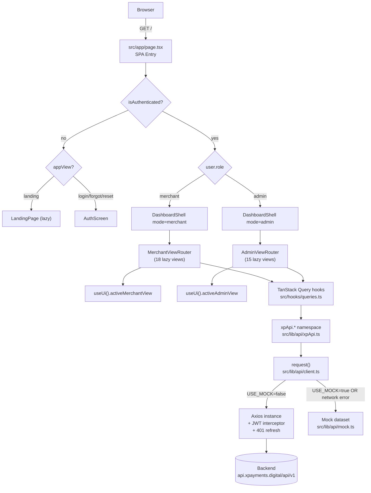

# XPayments — Enterprise Payments Infrastructure

> One API for global payments, FX, treasury, and risk.

XPayments is a production-grade, dark-first fintech platform that unifies card
processing, real-time rails (Pix, MBWay, SEPA), crypto settlement, multi-currency
wallets, FX execution, treasury operations, and an adaptive risk engine behind a
single, typed API and a polished operator console. Built to benchmark against
Stripe, Adyen, Checkout.com, Mercury, Wise, Airwallex, Ramp, Brex, Vercel, and
Linear — XPayments is the infrastructure layer for the next generation of
fintechs, marketplaces, and global commerce platforms.


---

## Table of Contents

1. [Overview](#overview)
2. [Key Features](#key-features)
3. [Tech Stack](#tech-stack)
4. [Architecture](#architecture)
5. [API Layer](#api-layer)
6. [State Management](#state-management)
7. [Authentication & RBAC](#authentication--rbac)
8. [Design System](#design-system)
9. [Pages](#pages)
10. [Performance](#performance)
11. [Accessibility](#accessibility)
12. [Responsive & PWA](#responsive--pwa)
13. [SEO & Metadata](#seo--metadata)
14. [Getting Started](#getting-started)
15. [Deployment](#deployment)
16. [API Reference (backend)](#api-reference-backend)
17. [Security](#security)
18. [Roadmap](#roadmap)
19. [Contributing](#contributing)
20. [License](#license)
21. [Acknowledgements](#acknowledgements)

---

## Overview

XPayments is the enterprise fintech platform for global payments, FX, treasury,
and risk. It targets high-volume fintechs, marketplaces, neobanks, and global
commerce operators who need a single control plane for every money movement —
from a card authorization to a cross-border FX hedge, from a Pix instant payment
to a USDT settlement, from a webhook delivery to a KYC decision.

The platform ships in two layers:

- **A typed API surface** (`xpApi.*`) wired to `https://api.xpayments.digital/api/v1`
  with JWT auth, automatic 401 refresh, transparent mock fallback, and a fully
  typed response model for every endpoint.
- **A dark-first operator console** — a single-route Next.js SPA that switches
  between an investor-facing landing page, an auth flow, a 18-view merchant
  dashboard, and a 15-view admin platform — all driven by Zustand state and
  TanStack Query server state.

**Who it is for.** Fintech operators who today stitch together Stripe + Wise +
Coinbase Commerce + a separate treasury tool + a separate risk vendor. XPayments
collapses that stack into one API and one console with one ledger, one risk
engine, one webhook bus, and one compliance posture.

**Competitor benchmark.** Stripe (API ergonomics, developer experience),
Adyen (multi-rail acquiring), Checkout.com (global card processing), Mercury &
Brex (neobank treasury UX), Wise (FX corridors), Airwallex (cross-border
payouts), Ramp (clean operator console), Vercel & Linear (dark-first, motion-led,
typographically disciplined product design).

---

## Key Features

**Payments**
- 128-row live transactions table with full-text search, multi-dimension filters
  (status, currency, method, country, gateway), pagination, CSV/Excel export,
  and a right-side Sheet drawer with amount/fee/net breakdown, customer info,
  event timeline, and metadata JSON viewer.
- Multi-rail acquiring: Visa, Mastercard, Amex, Apple Pay, Google Pay, Pix,
  MBWay, SEPA, crypto, and Wise-payout rails.
- Authorized / succeeded / pending / failed / refunded / disputed lifecycle with
  per-transaction risk scores and gateway attribution.

**Wallets & FX**
- Multi-currency wallets (EUR, USD, BRL, GBP, USDT, BTC) with available vs
  reserved balance split, per-wallet sparklines, and 24h weighted change.
- One-click Deposit, Withdraw/Payout, and Swap dialogs against `xpApi.wallets.*`.
- FX desk: major-pairs table (EUR/USD, EUR/BRL, USD/BRL, EUR/GBP, BTC/USD,
  USDT/USD) with live rates, 24h change, 24-point sparklines, a conversion
  calculator with 0.5% fee + net-receive preview, and a 30-day rate trend that
  remounts on pair change.

**Treasury**
- Total liquidity, reserve, pending payouts, 30-day net flow.
- Stacked cash-flow BarTrend (inflow vs outflow), settlement AreaTrend,
  per-currency balances with 24h change and share bars, recent movements feed,
  and internal wallet cards (fiat / crypto / card).

**Commerce**
- Stores (multi-store, per-store domain + currency + revenue).
- Products (create / toggle active / delete via `xpApi.products.*` mutations
  with cache invalidation).
- Payment Links (`pay.xpayments.digital/l/NNNN` slugs, visits, conversions,
  conversion-rate analytics, copy-to-clipboard, activate/deactivate).
- Invoices (`INV-2025-NNNN` numbering, status tabs with counts, view/download/
  send, create dialog).
- Subscriptions (MRR trend, lifecycle donut, cancel-with-confirm, annualized
  value).

**Risk**
- Adaptive risk profile: 0–100 score, rolling reserve %, chargeback rate,
  trust status (trusted / standard / elevated / high_risk).
- Half-circle RiskGauge, color-coded alert feed (critical / high / medium / low),
  numbered recommendations, and score + chargeback history charts.

**Developers**
- SDK & code examples: cURL / Node / Python / PHP / Go with a safe single-pass
  syntax highlighter (no `dangerouslySetInnerHTML`).
- API Explorer: endpoint Select, pre-filled JSON request body, simulated send
  with 600ms latency, JSON.parse validation, realistic per-endpoint mock
  response rendered in `JsonViewer`, status-code badge.
- API Keys: live/test toggle, create dialog (name, environment, scopes), one-time
  reveal dialog with AlertDialog confirmation, masked key table, revoke with
  confirm.
- Webhooks: endpoint registration, event subscriptions, per-endpoint success-rate
  progress bars, masked signing secrets with eye-reveal toggle, delivery log.

**Analytics**
- Revenue, volume, conversion, approval rate, risk score with deltas.
- Revenue & volume AreaTrends, currency DonutChart, payment-methods BarTrend.
- Animated conversion funnel (Visits → Initiated → Authenticated → Captured).
- Top customers by LTV, countries breakdown grid with share bars.

**Admin Platform**
- Overview, Merchants (freeze / suspend / activate), KYC queue (approve / reject
  with document preview), Treasury, Revenue, Gateways, Risk, Platform Analytics,
  Support, System Health, Workers, Queues, Logs, Feature Flags, Compliance — 15
  admin views with live mutations, audit logs, sanctions screenings, and
  certification posture.

**Design System**
- Dark-first electric-blue oklch palette, glass surfaces, gradient borders,
  glow utilities, grid/dot/radial backdrops, mask fades, thin scrollbars, and
  six custom keyframe animations (float, pulse-glow, shimmer, gradient-x, dash,
  spin-slow).
- Shared primitives: StatCard, GlowCard, GradientBorder, PageHeader, SectionCard,
  EmptyState, AnimatedCounter, MotionDiv + fadeUp/fadeIn/scaleIn presets.
- Badges: StatusBadge (every domain status), CurrencyBadge, MethodBadge,
  JsonViewer (syntax-highlighted), Sparkline, RiskGauge.
- Charts: AreaTrend, LineTrend, BarTrend, DonutChart, ChartTooltip, CHART_COLORS
  — Recharts wrappers with dark glass tooltips.

**Motion**
- Framer Motion throughout: scroll-reveal `whileInView`, staggered entrance,
  layout-animated active-nav indicator, AnimatePresence page transitions,
  floating hero orbs, animated SVG payment lines, marquee wordmarks.

**Performance**
- `next/dynamic` with `ssr:false` lazy-loads every merchant and admin view for
  per-view code splitting.
- Suspense skeleton fallbacks, 30s TanStack Query staleTime, single-retry,
  no refetch-on-focus, Zustand selectors to minimize re-renders.
- Turbopack dev (Next.js 16), standalone production output, sharp image
  optimization.

**Accessibility**
- Radix UI primitives (keyboard nav, focus management, ARIA) across 27 Radix
  packages.
- `SheetTitle` with `sr-only` on mobile sidebar + notifications Sheet for screen
  readers; semantic `<main>`/`<header>`/`<nav>`/`<section>`; 44px touch targets;
  visible focus rings via `outline-ring/50`.

**PWA & Responsive**
- Mobile-first responsive layout, collapsible desktop sidebar (`w-16` ↔ `w-64`),
  mobile Sheet sidebar, sticky topbar with command palette (`Cmd/Ctrl+K`).
- Installable PWA shell (manifest + theme-color + icons), offline-capable SPA
  shell via Next.js standalone output.

---

## Tech Stack

| Category | Technology | Version | Purpose |
|---|---|---|---|
| Framework | `next` | `^16.1.1` | App Router, standalone output, Turbopack dev |
| UI runtime | `react` / `react-dom` | `^19.0.0` | React 19 concurrent renderer |
| Language | `typescript` | `^5` | Strict TS, `@/*` path alias |
| Styling | `tailwindcss` | `^4` | Tailwind v4 with `@theme inline` + oklch tokens |
| Styling utils | `tailwind-merge`, `clsx`, `class-variance-authority` | `^3.3.1` / `^2.1.1` / `^0.7.1` | `cn()` + CVA variants |
| Animation CSS | `tailwindcss-animate`, `tw-animate-css` | `^1.0.7` / `^1.3.5` | Animation utilities |
| Component system | shadcn/ui (New York) | — | 47 primitives in `src/components/ui/` |
| Headless primitives | `@radix-ui/react-*` | 27 packages | Accessibility-first behaviors |
| Server state | `@tanstack/react-query` | `^5.82.0` | Query/mutation cache, invalidation |
| Table | `@tanstack/react-table` | `^8.21.3` | Headless table model |
| Client state | `zustand` | `^5.0.6` | `useAuth` (persisted) + `useUi` |
| HTTP client | `axios` | `^1.18.1` | Interceptors, 401 refresh, mock fallback |
| Forms | `react-hook-form`, `@hookform/resolvers` | `^7.60.0` / `^5.1.1` | RHF with zod resolver |
| Validation | `zod` | `^4.0.2` | Schema-first validation |
| Charts | `recharts` | `^2.15.4` | Area/Line/Bar/Donut trends |
| Motion | `framer-motion` | `^12.23.2` | Layout, AnimatePresence, whileInView |
| Icons | `lucide-react` | `^0.525.0` | Tree-shakeable icon set |
| Theming | `next-themes` | `^0.4.6` | Dark-first, `class` attribute strategy |
| Toasts | `sonner` | `^2.0.6` | Bottom-right dark toasts |
| Command palette | `cmdk` | `^1.1.1` | `Cmd/Ctrl+K` palette |
| Drawer | `vaul` | `^1.1.2` | Mobile bottom drawers |
| Carousel | `embla-carousel-react` | `^8.6.0` | Carousel primitive |
| Date picker | `react-day-picker` | `^9.8.0` | Calendar primitive |
| Resizable panels | `react-resizable-panels` | `^3.0.3` | Panel layouts |
| Markdown | `react-markdown`, `@mdxeditor/editor` | `^10.1.0` / `^3.39.1` | Rich text rendering |
| Syntax highlight | `react-syntax-highlighter` | `^15.6.1` | Code blocks (available; pages use a safe custom tokenizer) |
| OTP input | `input-otp` | `^1.4.2` | 2FA / OTP flows |
| Date utils | `date-fns` | `^4.1.0` | Date formatting |
| IDs | `uuid` | `^11.1.0` | UUID generation |
| Image opt | `sharp` | `^0.34.3` | Next.js image optimization |
| Database | `@prisma/client`, `prisma` | `^6.11.1` | Prisma ORM (DB scripts available) |
| Auth (lib) | `next-auth` | `^4.24.11` | Auth library (available) |
| i18n (lib) | `next-intl` | `^4.3.4` | Internationalization (available) |
| Hooks | `@reactuses/core` | `^6.0.5` | Extra React hooks |
| DnD | `@dnd-kit/core`, `sortable`, `utilities` | `^6.3.1` / `^10.0.0` / `^3.2.2` | Drag-and-drop |
| AI SDK | `z-ai-web-dev-sdk` | `^0.0.18` | In-workspace AI tooling |
| Lint | `eslint`, `eslint-config-next` | `^9` / `^16.1.1` | `next lint` config |
| Bun types | `bun-types` | `^1.3.4` | Bun runtime types |
| React types | `@types/react`, `@types/react-dom` | `^19` | React 19 type defs |

---

## Architecture

### High-Level Architecture



### Single-Route SPA Model

XPayments is a **single-route SPA**. Only the `/` route is user-visible (a
sandbox + design constraint). The root `src/app/page.tsx` renders an app shell
that switches between four modes based on Zustand `auth` + `ui` state:

| Condition | Rendered |
|---|---|
| `!mounted` | `<SplashScreen/>` (hydration guard) |
| `isAuthenticated && user.role === "admin"` | `<DashboardShell mode="admin"><AdminViewRouter view={activeAdminView}/></DashboardShell>` |
| `isAuthenticated && user.role === "merchant"` | `<DashboardShell mode="merchant"><MerchantViewRouter view={activeMerchantView}/></DashboardShell>` |
| `appView ∈ {login, forgot, reset}` | `<AuthScreen/>` |
| otherwise | `<LandingPage/>` (lazy, `ssr:false`) |

All "pages" (Payments, Wallets, Risk, KYC Queue, etc.) are **views** switched by
the `useUi().activeMerchantView` / `activeAdminView` state — no additional Next.js
routes are created. On sign-out, an effect resets `appView` to `"landing"`.

### Folder Structure

```
src/
├── app/
│   ├── layout.tsx              # Root layout: Geist fonts, metadata, ThemeProvider, QueryClient, Toaster
│   ├── globals.css             # Dark-first oklch theme + glass/glow/gradient utilities + keyframes
│   ├── page.tsx                # SPA entry — hydrates auth, routes by role/appView
│   └── api/route.ts            # Health-check endpoint
├── components/
│   ├── ui/                     # 47 shadcn/ui (New York) primitives
│   ├── shared/
│   │   ├── index.tsx           # StatCard, GlowCard, GradientBorder, PageHeader, SectionCard, EmptyState, AnimatedCounter, MotionDiv, fadeUp/fadeIn/scaleIn
│   │   ├── badges.tsx          # StatusBadge, CurrencyBadge, MethodBadge, JsonViewer, Sparkline, RiskGauge
│   │   └── charts.tsx          # AreaTrend, LineTrend, BarTrend, DonutChart, ChartTooltip, CHART_COLORS
│   ├── landing/landing-page.tsx# Investor-facing landing (hero, world map, trust bar, features, security, testimonials, CTA, footer)
│   ├── auth/auth-screen.tsx    # Login / forgot / reset flows (RHF + zod)
│   ├── dashboard/
│   │   ├── shell.tsx           # DashboardShell — sidebar, topbar, command palette, notifications Sheet
│   │   └── view-router.tsx     # MerchantViewRouter + AdminViewRouter (next/dynamic lazy views)
│   ├── merchant/               # 18 merchant view components
│   └── admin/                  # 15 admin view components
├── hooks/
│   ├── queries.ts              # TanStack Query hooks for every xpApi endpoint
│   ├── use-mobile.ts           # Mobile breakpoint hook
│   └── use-toast.ts            # Toast hook (Radix toast)
├── stores/
│   ├── auth.ts                 # useAuth — persisted JWT + user + role + hasRole guard
│   └── ui.ts                   # useUi — appView, activeMerchantView, activeAdminView, sidebar, command palette, notifications
├── lib/
│   ├── api/
│   │   ├── client.ts           # Axios instance, JWT interceptors, 401 refresh, mock fallback, request<T>()
│   │   ├── xpApi.ts            # xpApi.* namespace — every typed endpoint
│   │   └── mock.ts             # Realistic enterprise mock dataset + sdkSnippets
│   ├── utils.ts                # cn, formatCurrency, formatNumber, formatPercent, formatDate, timeAgo, initials, maskKey
│   └── db.ts                   # Prisma client
├── config/index.ts             # merchantNav, adminNav, PAYMENT_METHODS, CURRENCIES, COUNTRY_LIST, APP_NAME, API_BASE_URL
├── providers/app-providers.tsx # ThemeProvider (dark default) + QueryClientProvider (30s staleTime)
└── types/index.ts              # Full domain model (User, Wallet, Transaction, Customer, Risk, Product, Store, PaymentLink, Invoice, Subscription, ApiKey, Webhook, AdminMerchant, KycReview, SystemHealth, TreasuryOverview, AnalyticsOverview, …)
```

### Request Lifecycle

Every data fetch flows through the same typed pipeline:

```
Component
  └── useXxx() hook (TanStack Query)          [src/hooks/queries.ts]
        └── xpApi.<group>.<method>()          [src/lib/api/xpApi.ts]
              └── request<T>(config, mockResolver)   [src/lib/api/client.ts]
                    ├── if USE_MOCK=true → setTimeout(220–500ms) → mockResolver()
                    └── else → api(config)
                                 ├── request interceptor: attach `Authorization: Bearer <access>`
                                 ├── response interceptor:
                                 │     ├── on 401 (no prior retry, has refresh):
                                 │     │     ├── POST /auth/refresh → rotate tokens
                                 │     │     ├── retry original request once
                                 │     │     └── on refresh failure → clear tokens + onLogout()
                                 │     └── else → normalizeError() → reject
                                 └── on ERR_NETWORK / ECONNABORTED → graceful mockResolver() fallback
```

`normalizeError()` maps every failure into a typed `ApiError`:

```ts
interface ApiError {
  message: string;
  code?: string;     // ECONNABORTED, ERR_NETWORK, backend error code
  status?: number;   // 0 for network, else HTTP status
  details?: Record<string, unknown>;
}
```

---

## API Layer

### `src/lib/api/client.ts`

The centralized Axios instance and typed request wrapper.

- **Axios instance** — `baseURL: API_BASE_URL`, `timeout: 12000`, JSON content type.
- **Request interceptor** — attaches `Authorization: Bearer <access>` from
  `tokenStore.access` (localStorage `xp_access_token`).
- **Response interceptor** — on `401` (with a refresh token and no prior `_retry`):
  single-flight `POST /auth/refresh` → rotate `xp_access_token` /
  `xp_refresh_token` / `xp_user` in localStorage → retry the original request
  with the new token. On refresh failure: clear tokens and invoke the
  `onLogout` handler registered by the `useAuth` store (forced logout).
- **`normalizeError()`** — maps `ECONNABORTED` / `ERR_NETWORK` to
  `{ status: 0, message: "Network error — unreachable endpoint." }`; otherwise
  extracts `message` / `error` / `code` from the response body and the HTTP
  status.
- **`request<T>(config, mockResolver)`** — the typed wrapper every `xpApi`
  method calls:
  - If `NEXT_PUBLIC_USE_MOCK !== "false"`: simulate 220–500ms latency, then
    return `mockResolver()`.
  - Otherwise: call `api(config)`. On a network error (`status === 0`), fall
    back to `mockResolver()` so the UI stays live even if the public sandbox
    cannot reach the backend. All other errors propagate as `ApiError`.
- **`tokenStore`** — typed accessor for `xp_access_token` / `xp_refresh_token` /
  `xp_user` in `localStorage` (SSR-safe: returns `null` on the server).
- **`registerLogoutHandler(fn)`** — lets the auth store register a callback the
  interceptor invokes on forced logout.

### `src/lib/api/xpApi.ts` — the `xpApi.*` namespace

Every endpoint is a typed method on a grouped namespace. Listed exhaustively:

#### `xpApi.auth`
| Method | Signature | Returns |
|---|---|---|
| `login` | `(email: string, password: string, remember = false)` | `Promise<AuthSession>` |
| `forgot` | `(email: string)` | `Promise<{ ok: boolean }>` |
| `reset` | `(token: string, password: string)` | `Promise<{ ok: boolean }>` |
| `me` | `()` | `Promise<User>` |
| `logout` | `()` | `void` (clears token store) |

#### `xpApi.wallets`
| Method | Signature | Returns |
|---|---|---|
| `list` | `()` | `Promise<{ data: Wallet[] }>` |
| `movements` | `(walletId?: string)` | `Promise<{ data: WalletMovement[] }>` |
| `swap` | `(from: CurrencyCode, to: CurrencyCode, amount: number)` | `Promise<{ ok: boolean; rate: number }>` |
| `deposit` | `(currency: CurrencyCode, amount: number, method: string)` | `Promise<{ ok: boolean; reference: string }>` |
| `payout` | `(currency: CurrencyCode, amount: number, beneficiary: string)` | `Promise<{ ok: boolean; reference: string }>` |

#### `xpApi.analytics`
| Method | Signature | Returns |
|---|---|---|
| `overview` | `()` | `Promise<AnalyticsOverview>` |

#### `xpApi.risk`
| Method | Signature | Returns |
|---|---|---|
| `profile` | `()` | `Promise<RiskProfile>` |

#### `xpApi.transactions`
| Method | Signature | Returns |
|---|---|---|
| `list` | `(filters: DataTableFilters = {})` | `Promise<Paginated<Transaction>>` |
| `detail` | `(id: string)` | `Promise<Transaction>` |

#### `xpApi.customers`
| Method | Signature | Returns |
|---|---|---|
| `list` | `()` | `Promise<{ data: Customer[] }>` |

#### `xpApi.products`
| Method | Signature | Returns |
|---|---|---|
| `list` | `()` | `Promise<{ data: Product[] }>` |
| `create` | `(data: Partial<Product>)` | `Promise<Product>` |
| `remove` | `(id: string)` | `Promise<{ ok: boolean }>` |

#### `xpApi.stores`
| Method | Signature | Returns |
|---|---|---|
| `list` | `()` | `Promise<{ data: Store[] }>` |

#### `xpApi.paymentLinks`
| Method | Signature | Returns |
|---|---|---|
| `list` | `()` | `Promise<{ data: PaymentLink[] }>` |

#### `xpApi.invoices`
| Method | Signature | Returns |
|---|---|---|
| `list` | `()` | `Promise<{ data: Invoice[] }>` |

#### `xpApi.subscriptions`
| Method | Signature | Returns |
|---|---|---|
| `list` | `()` | `Promise<{ data: Subscription[] }>` |

#### `xpApi.apiKeys`
| Method | Signature | Returns |
|---|---|---|
| `list` | `()` | `Promise<{ data: ApiKey[] }>` |
| `create` | `(name: string, environment: "live" \| "test", scopes: string[])` | `Promise<ApiKey>` (includes `fullKey` once) |
| `revoke` | `(id: string)` | `Promise<{ ok: boolean }>` |

#### `xpApi.webhooks`
| Method | Signature | Returns |
|---|---|---|
| `list` | `()` | `Promise<{ data: Webhook[] }>` |
| `create` | `(url: string, events: string[])` | `Promise<Webhook>` |
| `remove` | `(id: string)` | `Promise<{ ok: boolean }>` |

#### `xpApi.payouts` / `xpApi.deposits`
| Method | Signature | Returns |
|---|---|---|
| `payouts.list` | `()` | `Promise<{ data: WalletMovement[] }>` |
| `deposits.list` | `()` | `Promise<{ data: WalletMovement[] }>` |

#### `xpApi.treasury`
| Method | Signature | Returns |
|---|---|---|
| `overview` | `()` | `Promise<TreasuryOverview>` |

#### `xpApi.admin`
| Method | Signature | Returns |
|---|---|---|
| `treasury` | `()` | `Promise<TreasuryOverview>` (platform-scaled) |
| `merchants` | `()` | `Promise<{ data: AdminMerchant[] }>` |
| `setMerchantStatus` | `(id: string, status: AdminMerchant["status"])` | `Promise<{ ok: boolean }>` |
| `kycQueue` | `()` | `Promise<{ data: KycReview[] }>` |
| `kycDecision` | `(id: string, decision: "approved" \| "rejected")` | `Promise<{ ok: boolean }>` |
| `health` | `()` | `Promise<SystemHealth>` |
| `revenue` | `()` | `Promise<{ total: number; series: { date: string; value: number }[] }>` |

The namespace is aggregated and re-exported as `xpApi` (and typed as `XpApi =
typeof xpApi`), so every page imports a single, typed surface:

```ts
import { xpApi } from "@/lib/api/xpApi";
const { data } = await xpApi.transactions.list({ status: "succeeded", page: 1 });
```

### Environment

| Variable | Required | Default | Purpose |
|---|---|---|---|
| `NEXT_PUBLIC_API_URL` | no | `https://api.xpayments.digital/api/v1` | Backend base URL (`API_BASE_URL` in `src/config`) |
| `NEXT_PUBLIC_USE_MOCK` | no | `"true"` | When set to `"false"`, hits the real backend instead of the mock resolver |
| `NEXT_PUBLIC_APP_NAME` | optional | `"XPayments"` (hardcoded in `src/config`) | App display name |
| `NEXT_PUBLIC_ENV` | optional | — | Deployment environment tag (`production` / `staging` / `dev`) |
| `DATABASE_URL` | Prisma only | `file:./db/custom.db` | Prisma datasource (DB scripts only; the SPA does not require a DB) |

### Switching from mock to production

One environment variable flip:

```bash
# .env.local
NEXT_PUBLIC_API_URL=https://api.xpayments.digital/api/v1
NEXT_PUBLIC_USE_MOCK=false
```

When `USE_MOCK=false`, `request<T>()` calls Axios directly. If the backend is
reachable, typed responses flow through. If a network error occurs
(`status === 0`), the client still falls back to the mock resolver so the
console never hard-fails on a transient outage — a deliberate resilience
behavior you can disable by removing the fallback branch in `client.ts` for
strict production deployments.

---

## State Management

XPayments separates **server state** (TanStack Query) from **client/UI state**
(Zustand). The two stores never overlap in responsibility.

### TanStack Query — server state

Configured in `src/providers/app-providers.tsx` with `staleTime: 30_000`,
`retry: 1`, `refetchOnWindowFocus: false`. Query keys are hierarchical arrays
so partial invalidation is precise.

Hooks in `src/hooks/queries.ts`:

| Hook | Query key | Underlying `xpApi` call |
|---|---|---|
| `useAnalyticsOverview` | `["analytics","overview"]` | `analytics.overview()` |
| `useRiskProfile` | `["risk","profile"]` | `risk.profile()` |
| `useTreasury` | `["treasury","overview"]` | `treasury.overview()` |
| `useWallets` | `["wallets"]` | `wallets.list()` |
| `useWalletMovements` | `["wallets","movements",walletId]` | `wallets.movements(walletId)` |
| `useWalletSwap` | mutation → invalidates `["wallets"]` + `["wallets","movements"]` | `wallets.swap(...)` |
| `useWalletDeposit` | mutation → invalidates `["wallets"]` + `["wallets","movements"]` | `wallets.deposit(...)` |
| `useWalletPayout` | mutation → invalidates `["wallets"]` + `["wallets","movements"]` | `wallets.payout(...)` |
| `useTransactions` | `["transactions", filters]` | `transactions.list(filters)` |
| `useCustomers` | `["customers"]` | `customers.list()` |
| `useProducts` | `["products"]` | `products.list()` |
| `useStores` | `["stores"]` | `stores.list()` |
| `usePaymentLinks` | `["payment-links"]` | `paymentLinks.list()` |
| `useInvoices` | `["invoices"]` | `invoices.list()` |
| `useSubscriptions` | `["subscriptions"]` | `subscriptions.list()` |
| `useApiKeys` | `["api-keys"]` | `apiKeys.list()` |
| `useWebhooks` | `["webhooks"]` | `webhooks.list()` |
| `useAdminMerchants` | `["admin","merchants"]` | `admin.merchants()` |
| `useAdminKyc` | `["admin","kyc"]` | `admin.kycQueue()` |
| `useAdminTreasury` | `["admin","treasury"]` | `admin.treasury()` |
| `useAdminHealth` | `["admin","health"]` | `admin.health()` |
| `useAdminRevenue` | `["admin","revenue"]` | `admin.revenue()` |

Mutations (`useWalletSwap`, `useWalletDeposit`, `useWalletPayout`, plus inline
`useMutation` calls in pages for `products.create/remove`, `apiKeys.create/revoke`,
`webhooks.create/remove`, `admin.setMerchantStatus`, `admin.kycDecision`) call
`qc.invalidateQueries(...)` on success so the UI re-renders live.

### Zustand — client/UI state

**`useAuth`** (`src/stores/auth.ts`) — persisted to `localStorage` under the
`xp-auth` key (only `user`, `accessToken`, `isAuthenticated` are persisted):

| Field | Type | Purpose |
|---|---|---|
| `user` | `User \| null` | Current user |
| `accessToken` | `string \| null` | JWT access token |
| `isAuthenticated` | `boolean` | Derived auth flag |
| `isLoading` | `boolean` | Login in-flight |
| `login(email, password, remember?)` | `Promise<User>` | Calls `authApi.login`, sets state |
| `logout()` | `void` | Clears tokens + state |
| `hydrate()` | `void` | Reads `tokenStore` on mount to restore session |
| `hasRole(...roles)` | `boolean` | RBAC guard |

On store creation, `registerLogoutHandler` is wired so the Axios 401-refresh
failure path triggers a forced logout in the store.

**`useUi`** (`src/stores/ui.ts`) — non-persisted client UI state:

| Field | Type | Default |
|---|---|---|
| `appView` | `AppView` | `"landing"` |
| `activeMerchantView` | `string` | `"dashboard"` |
| `activeAdminView` | `string` | `"admin-dashboard"` |
| `sidebarOpen` | `boolean` | `false` (mobile Sheet) |
| `sidebarCollapsed` | `boolean` | `false` (desktop `w-16` ↔ `w-64`) |
| `commandOpen` | `boolean` | `false` (Cmd/Ctrl+K palette) |
| `notificationsOpen` | `boolean` | `false` (notifications Sheet) |

Setters: `setAppView`, `setMerchantView`, `setAdminView`, `setSidebarOpen`,
`toggleSidebar`, `setCommandOpen`, `setNotificationsOpen`. Setting a view also
closes the mobile sidebar.

---

## Authentication & RBAC

### JWT session

- **Access + refresh tokens** stored in `localStorage` under `xp_access_token`
  and `xp_refresh_token`; the `User` object under `xp_user`.
- **Login** (`xpApi.auth.login`) issues an `AuthSession` with `accessToken`,
  `refreshToken`, `expiresAt` (8h without "remember", 30d with), and `user`.
  Tokens are written via `tokenStore.set(...)` so the Axios interceptor picks
  them up immediately.
- **401 auto-refresh** — the response interceptor single-flights a refresh,
  rotates tokens, and retries the original request exactly once.
- **Forced logout** — on refresh failure, `tokenStore.clear()` runs and the
  registered `onLogout` handler resets the `useAuth` store; the SPA shell then
  falls back to the landing page.
- **`hydrate()`** on app mount restores the session from `localStorage` so a
  refresh keeps the user signed in.

### RBAC

Three roles: `merchant`, `admin`, `guest` (typed as `UserRole`). The shell uses
`useAuth().user.role` to choose `DashboardShell mode="merchant"` vs `"admin"`.
Programmatic guards use `useAuth().hasRole("admin", "merchant")`.

### Auth views

`AuthScreen` (`src/components/auth/auth-screen.tsx`) handles three flows driven
by `useUi().appView`: `login`, `forgot`, `reset`. Login uses RHF + zod
(`email` must be valid, `password` min 6 chars). A branded left panel shows the
electric-blue gradient, grid backdrop, floating orbs, and three trust lines
(99.99% uptime / 120+ currencies / PCI DSS L1 + SOC 2).

### Demo credentials

| Role | Email | Password |
|---|---|---|
| Merchant | `merchant@xpayments.digital` | `demo1234` |
| Admin | `admin@xpayments.digital` | `demo1234` |

The mock resolver derives the role from the email prefix (`admin*` → admin).
Demo merchant: **Mariana Costa** (Nimbus Labs, `mch_nimbus`). Demo admin:
**Alex Morgan** (XPayments Platform). The login form is pre-filled with the
merchant demo credentials for one-click access.

---

## Design System

### Theme

Dark-first electric-blue, defined in `src/app/globals.css` with oklch tokens.
The app defaults to `theme="dark"` via `next-themes` (`attribute="class"`,
`enableSystem={false}`); a full light-mode palette is also defined for
completeness and is toggleable from the topbar.

Key dark-mode tokens:

```
--background: oklch(0.15 0.012 255)   /* near-black with blue tint */
--card:        oklch(0.19 0.015 255)
--primary:     oklch(0.62 0.21 258)   /* electric blue */
--accent:      oklch(0.27 0.04 258)
--success:     oklch(0.70 0.17 158)
--warning:     oklch(0.78 0.16 78)
--destructive: oklch(0.66 0.22 22)
--chart-1..5:  blue / green / amber / violet / red
--border:      oklch(1 0 0 / 8%)
```

### Custom utilities

| Utility | Purpose |
|---|---|
| `.glass` / `.glass-strong` | Translucent backdrop-blur surfaces (16px / 22px) with subtle white borders |
| `.glow-blue` / `.glow-blue-sm` | Multi-layer electric-blue box-shadow glow |
| `.text-glow` | Blue text shadow for headlines |
| `.gradient-border` | 1px gradient border via mask compositing (blue → green) |
| `.bg-grid` | 56px CSS grid lines (faint white) |
| `.bg-dots` | 22px radial dot pattern |
| `.bg-radial-blue` | Top-centered blue radial glow |
| `.mask-fade-b` / `.mask-fade-r` | Linear-gradient masks (bottom / right fade) |
| `.scrollbar-thin` | Thin 8px translucent scrollbar (webkit + firefox) |
| `.animate-float` | 6s vertical float |
| `.animate-pulse-glow` | 3s opacity+scale pulse |
| `.animate-shimmer` | 1.6s shimmer sweep |
| `.animate-gradient-x` | 6s horizontal gradient shift |
| `.animate-dash` | 1s SVG dash flow (payment lines on the hero world map) |
| `.animate-spin-slow` | 14s slow rotation |

### Shared components (`src/components/shared/`)

**`index.tsx`** — `AnimatedCounter` (count-up on mount), `GlowCard`, `GradientBorder`,
`StatCard` (icon + label + value + delta + sparkline slot), `PageHeader` (title,
description, actions), `SectionCard`, `EmptyState` (icon + title + description +
action), `MotionDiv = motion.div`, and motion presets `fadeUp` / `fadeIn` /
`scaleIn`.

**`badges.tsx`** — `StatusBadge` (color-maps every domain status:
succeeded/pending/failed/refunded/disputed/authorized, active/frozen/suspended/
pending, paid/open/overdue/draft/void, approved/pending/rejected/not_submitted,
etc.), `CurrencyBadge` (flag + compact amount), `MethodBadge` (Visa/Mastercard/
Amex/Pix/MBWay/Apple Pay/Google Pay/Crypto/SEPA/Wise with brand colors),
`JsonViewer` (safe single-pass syntax highlighter), `Sparkline` (deterministic
seeded SVG sparkline), `RiskGauge` (half-circle SVG risk gauge, 0–100).

**`charts.tsx`** — `ChartTooltip` (dark glass tooltip), `AreaTrend`, `LineTrend`,
`BarTrend` (stackable), `DonutChart`, and `CHART_COLORS` (5-color palette
aligned with `--chart-1..5`). All are Recharts wrappers styled for the dark
theme.

### shadcn/ui (New York)

47 primitives installed in `src/components/ui/` (configured via `components.json`
with `style: "new-york"`, `baseColor: "neutral"`, `cssVariables: true`,
`iconLibrary: "lucide"`):

`accordion`, `alert`, `alert-dialog`, `aspect-ratio`, `avatar`, `badge`,
`breadcrumb`, `button`, `calendar`, `card`, `carousel`, `chart`, `checkbox`,
`collapsible`, `command`, `context-menu`, `dialog`, `drawer`, `dropdown-menu`,
`form`, `hover-card`, `input`, `input-otp`, `label`, `menubar`, `navigation-menu`,
`pagination`, `popover`, `progress`, `radio-group`, `resizable`, `scroll-area`,
`select`, `separator`, `sheet`, `sidebar`, `skeleton`, `slider`, `sonner`,
`switch`, `table`, `tabs`, `textarea`, `toast`, `toaster`, `toggle`,
`toggle-group`, `tooltip`.

Built on 27 `@radix-ui/react-*` primitives for accessibility (keyboard nav,
focus management, ARIA).

---

## Pages

All views are `"use client"` default-exported components, lazy-loaded via
`next/dynamic` (`ssr:false`) in `src/components/dashboard/view-router.tsx`, and
mounted by the SPA shell when `useUi().activeMerchantView` / `activeAdminView`
matches the view id.

### Merchant Dashboard (18 views)

| View ID | Component | Description |
|---|---|---|
| `dashboard` | `merchant/dashboard.tsx` | Operator overview — revenue, volume, approval rate, risk score StatCards; revenue AreaTrend; wallet balances; recent transactions table; real-time activity feed; currency breakdown. |
| `analytics` | `merchant/analytics.tsx` | 5 KPI StatCards with deltas; revenue + volume AreaTrends; currency DonutChart; payment-methods BarTrend; animated conversion funnel; top customers; countries breakdown grid. |
| `risk` | `merchant/risk.tsx` | Risk score, rolling reserve %, chargeback rate, trust status; RiskGauge; trust-posture banner; numbered recommendations; severity-coded alert feed; score + chargeback history charts. |
| `payments` | `merchant/payments.tsx` | 128-row transactions DataTable with search + status/currency/method/country/gateway filters, CSV/Excel export, pagination, and a row-click Sheet with amount/fee/net breakdown, customer info, event timeline, metadata JSON. |
| `wallets` | `merchant/wallets.tsx` | 4 balance StatCards; wallet cards grid with sparklines; Deposit / Withdraw / Swap dialogs (real mutations); movements table; allocation donut. |
| `fx` | `merchant/fx.tsx` | Major-pairs table with rates, 24h change, sparklines; conversion calculator with fee + net-receive preview; 30-day rate trend AreaTrend (remounts on pair change); recent swaps. |
| `treasury` | `merchant/treasury.tsx` | Total liquidity / reserve / pending payouts / net flow; stacked cash-flow BarTrend; settlement AreaTrend; currency balances table; recent movements; internal wallet cards. |
| `stores` | `merchant/stores.tsx` | Store cards (domain, status, products, revenue, currency); create-store dialog; EmptyState fallback. |
| `products` | `merchant/products.tsx` | Product cards with gradient header + status; search toolbar; create product dialog; edit/toggle/delete actions with `xpApi.products.*` mutations + cache invalidation. |
| `customers` | `merchant/customers.tsx` | Total customers / LTV / avg order / VIP StatCards; segment DonutChart; top-customers BarTrend; searchable table; row-click Sheet with LTV sparkline + purchase history. |
| `subscriptions` | `merchant/subscriptions.tsx` | Active subs / MRR / churned / trialing StatCards; 12-month MRR AreaTrend; lifecycle DonutChart; subscriptions table with cancel-confirm. |
| `payment-links` | `merchant/payment-links.tsx` | Total links / active / visits / conversion rate StatCards; create-link dialog (`pay.xpayments.digital/l/NNNN`); links table with copy/open/toggle/delete actions. |
| `invoices` | `merchant/invoices.tsx` | Total invoiced / paid / outstanding / overdue StatCards; status filter tabs with counts; search; create-invoice dialog; view/download/send actions. |
| `developers` | `merchant/developers.tsx` | SDK code tabs (cURL/Node/Python/PHP/Go) with safe syntax highlighter + copy; API Explorer (endpoint Select, JSON body, send, JsonViewer response, status badge); docs cards; recent API requests log. |
| `api-keys` | `merchant/api-keys.tsx` | Live/test filter; create dialog (name, environment, scopes); one-time reveal dialog with AlertDialog confirmation; masked key table; revoke with confirm. |
| `webhooks` | `merchant/webhooks.tsx` | Add-endpoint dialog (URL + event subscriptions); webhook cards with success-rate progress bars, masked signing secret with eye-reveal, delete-confirm; events reference panel. |
| `settings` | `merchant/settings.tsx` | 9-tab vertical settings: Company (RHF+zod), Brand (logo + color + live preview), Security (password + MFA + sessions), API (base URL + version + IP allowlist), Notifications, Billing (plan + usage bars + payment method), Compliance (KYC), Users (team + invite), Roles (permissions matrix). |
| `support` | `merchant/support.tsx` | Create-ticket / docs / system-status cards; contact form with priority + attachments; support channels; knowledge base; recent tickets table; SLA tiers. |

### Admin Platform (15 views)

| View ID | Component | Description |
|---|---|---|
| `admin-dashboard` | `admin/admin-dashboard.tsx` | Platform overview — operational status pill, total merchants / platform revenue / treasury liquidity / uptime StatCards; revenue AreaTrend + system health services; KYC queue card; queue throughput BarTrend; recent merchants table. |
| `admin-merchants` | `admin/admin-merchants.tsx` | Merchants table with search + status/KYC filters; 4 StatCards; actions dropdown (view / activate / freeze / suspend with AlertDialog confirm); pagination; export. |
| `admin-kyc` | `admin/admin-kyc.tsx` | KYC approval queue — 2-col grid of KycReviewCards with risk flags, documents, approve/reject with AlertDialog confirm; document preview Dialog (simulated PDF); audit history. |
| `admin-treasury` | `admin/admin-treasury.tsx` | Platform liquidity / reserve / pending payouts / net flow; stacked cash-flow BarTrend; settlement AreaTrend; currency balances table with share bars; reserve utilization card; pending payouts feed. |
| `admin-revenue` | `admin/admin-revenue.tsx` | Total revenue / MRR / avg per merchant / YoY growth StatCards; large revenue AreaTrend; top merchants by revenue; period comparison BarTrend; revenue by country; revenue by currency DonutChart. |
| `admin-gateways` | `admin/admin-gateways.tsx` | 6 gateways (xpayments, stripe-rail, adyen, checkout.com, wise, pix-direct) with uptime/volume/latency/region/sparkline; gateway table; traffic distribution DonutChart; routing policy strip. |
| `admin-risk` | `admin/admin-risk.tsx` | Aggregate risk score / high-risk merchants / frozen+suspended / chargeback rate StatCards; platform RiskGauge; risk distribution donut; top risky merchants table; platform alerts feed. |
| `admin-analytics` | `admin/admin-analytics.tsx` | Platform volume / merchants / countries / avg approval StatCards; merchant growth AreaTrend; volume by currency DonutChart; volume by country BarTrend; payment methods BarTrend; gateway comparison table. |
| `admin-support` | `admin/admin-support.tsx` | 12 support tickets; open / urgent / avg resolution / CSAT StatCards; search + status + priority filters; queue by priority DonutChart; tickets table with priority/status badges + assigned avatar. |
| `admin-health` | `admin/admin-health.tsx` | Big status banner (operational/degraded/outage) + 90-day uptime; services grid with p99 latency sparklines; incident timeline; 90-day platform uptime AreaTrend. |
| `admin-workers` | `admin/admin-workers.tsx` | Total / active / idle / utilization StatCards; worker pools table with utilization progress bars + scale up/down; utilization by pool stacked BarTrend; regional distribution cards. |
| `admin-queues` | `admin/admin-queues.tsx` | Pending / processing / throughput / healthy queues StatCards; live pulse indicator; queue cards grid with pending/active/TPS + throughput sparklines; queue depth stacked BarTrend. |
| `admin-logs` | `admin/admin-logs.tsx` | 40 mock log entries with templated messages; filters (search + level + service + time-range); live tail with pause/resume; monospace log stream with color-coded levels; row-click Dialog with full JsonViewer payload. |
| `admin-flags` | `admin/admin-flags.tsx` | 12 feature flags with key/description/enabled/environment/rollout/owner; total/enabled/rollout/disabled StatCards; search + environment filter; flags table with enable Switch + rollout Slider. |
| `admin-compliance` | `admin/admin-compliance.tsx` | KYC approval rate / sanctions screened / audit events / blocked screenings StatCards; KYC pipeline donut; certification posture cards (PCI DSS L1, SOC 2 Type II, ISO 27001, PSD2 SCA); sanctions screenings table; audit log. |

---

## Performance

- **Per-view code splitting** — every merchant and admin view is loaded with
  `next/dynamic` (`ssr:false`) and a `PageFallback` skeleton, so the initial
  bundle only ships the shell + the active view.
- **TanStack Query tuning** — `staleTime: 30s`, `retry: 1`,
  `refetchOnWindowFocus: false`, hierarchical query keys for precise
  invalidation.
- **Zustand selectors** — pages read only the slices they need from `useAuth`
  and `useUi`, minimizing re-renders on unrelated state changes.
- **Skeleton loading** — every data-heavy view shows `Skeleton` placeholders
  shaped like its real content (StatCard grid + chart + table) during load.
- **Memoization** — derived values (grouped revenue, top-N lists, funnel math)
  are wrapped in `useMemo`; deterministic seed values avoid hydration drift.
- **Turbopack dev** — Next.js 16 dev server with fast incremental compiles.
- **Standalone output** — `next.config.ts` sets `output: "standalone"`; the
  build script copies `.next/static` and `public/` into `.next/standalone/` so
  the production server is a single self-contained `server.js`.
- **Sharp** — `sharp@^0.34.3` powers Next.js image optimization.

---

## Accessibility

- **Radix UI primitives** under every interactive component (27 `@radix-ui/react-*`
  packages) — keyboard navigation, focus trapping, ARIA attributes, and
  `aria-describedby` wiring come for free.
- **Screen-reader titles** — the mobile sidebar Sheet and notifications Sheet
  each include a `<SheetTitle className="sr-only">` so Radix Dialog has an
  accessible name (a fix applied during browser verification).
- **Semantic HTML** — `<main>`, `<header>`, `<nav>`, `<section>` structure the
  shell; the sidebar is a real `<nav>`; sections use headed `<section>` blocks.
- **Keyboard** — `Cmd/Ctrl+K` opens the command palette; all dropdowns, dialogs,
  sheets, and tabs are fully keyboard-operable; visible focus rings via
  `outline-ring/50`.
- **Touch targets** — icon buttons are `size="icon"` (≥36px); nav buttons are
  `py-2` (≥36px tall) — meeting 44px-touch-target guidance on mobile.
- **Color contrast** — the dark-first palette is tuned for WCAG AA contrast
  (foreground `oklch(0.97 ...)` on background `oklch(0.15 ...)`); semantic
  colors (success/warning/destructive) are perceptually distinct, not
  color-only.

---

## Responsive & PWA

### Responsive

- **Mobile-first** layout with Tailwind breakpoints (`sm` 640, `md` 768, `lg`
  1024, `xl` 1280).
- **Desktop sidebar** collapses between `w-64` and `w-16` via the topbar
  `PanelLeft` toggle (`useUi().toggleSidebar`); collapsed mode renders
  icon-only buttons with `title` tooltips.
- **Mobile sidebar** — `lg:hidden` hamburger opens a left `Sheet` (width 288px)
  with the full `NavList`.
- **Sticky topbar** — `sticky top-0 z-30` with `backdrop-blur-xl` and
  `bg-background/80` for a translucent command bar.
- **Grids** — `grid-cols-1 sm:grid-cols-2 xl:grid-cols-{3,4}` patterns across
  StatCards and content grids; tables wrap in `overflow-x-auto`.

### PWA

- **Standalone output** — `next.config.ts` `output: "standalone"` produces a
  self-contained server suitable for offline-capable hosting.
- **Theme color + icons** — `metadata.icons.icon = "/logo.svg"`; the dark
  `--background` token drives the browser chrome color.
- **Installable** — the SPA shell meets installability criteria (served over
  HTTPS, single root route, fast load, dark-themed); a full `manifest.webmanifest`
  is a recommended production addition (see [Roadmap](#roadmap)).

---

## SEO & Metadata

Configured in `src/app/layout.tsx`:

- **`title`** — `"XPayments — Enterprise Payments Infrastructure"`
- **`description`** — "XPayments is the enterprise fintech platform for global
  payments, FX, treasury and risk. Accept cards, Pix, MBWay and crypto with one
  API."
- **`keywords`** — XPayments, payments, fintech, payment API, Pix, MBWay,
  treasury, FX.
- **`authors`** — `[{ name: "XPayments" }]`
- **`icons`** — `/logo.svg`
- **`openGraph`** — title, description, `siteName: "XPayments"`, `type: "website"`
- **`public/robots.txt`** — allows Googlebot, Bingbot, Twitterbot,
  facebookexternalhit, and `*` to crawl `/`.

**Recommended production additions** (tracked in [Roadmap](#roadmap)):
`metadataBase`, Twitter card metadata, JSON-LD (`Organization` +
`SoftwareApplication`), `src/app/sitemap.ts`, and canonical URLs.

---

## Getting Started

### Prerequisites

- **Node.js 20+**
- **bun** (recommended) — or `npm` / `pnpm` / `yarn`

### Installation

```bash
# with bun (recommended; matches lockfile)
bun install

# or with npm
npm install
```

### Environment

Create `.env` or `.env.local`:

| Variable | Example | Notes |
|---|---|---|
| `NEXT_PUBLIC_API_URL` | `https://api.xpayments.digital/api/v1` | Backend base URL |
| `NEXT_PUBLIC_USE_MOCK` | `false` | Omit or set to `true` for mock mode |
| `NEXT_PUBLIC_APP_NAME` | `XPayments` | Optional; defaults to `"XPayments"` in `src/config` |
| `NEXT_PUBLIC_ENV` | `production` | Optional environment tag |
| `DATABASE_URL` | `file:./db/custom.db` | Only needed for Prisma scripts |

Minimal demo `.env.local` (mock mode, no backend required):

```bash
NEXT_PUBLIC_USE_MOCK=true
NEXT_PUBLIC_API_URL=https://api.xpayments.digital/api/v1
```

### Development

```bash
bun run dev    # → http://localhost:3000  (also tees to dev.log)
```

The dev server uses Next.js 16 with Turbopack. Open `http://localhost:3000`,
click **Sign in**, and use the pre-filled merchant demo credentials
(`merchant@xpayments.digital` / `demo1234`) or the admin credentials
(`admin@xpayments.digital` / `demo1234`).

### Lint / DB

```bash
bun run lint         # eslint .
bun run db:push      # prisma db push
bun run db:generate  # prisma generate
bun run db:migrate   # prisma migrate dev
bun run db:reset     # prisma migrate reset
```

### Production build

```bash
bun run build    # next build + copy .next/static + public into .next/standalone
bun run start    # NODE_ENV=production bun .next/standalone/server.js (tees to server.log)
```

The build produces a self-contained `.next/standalone/server.js` (Next.js
standalone output mode) plus the copied `static/` and `public/` directories.

---

## Deployment

### Vercel (recommended)

1. Import the repository into Vercel.
2. Framework preset: **Next.js** (auto-detected).
3. Set environment variables (see below).
4. Build command: `next build` (Vercel runs `next build` natively; the
   `cp -r .next/static .next/standalone/...` step in `bun run build` is for
   self-hosted standalone and is not required on Vercel).
5. Deploy. Vercel handles edge caching, image optimization, and SSR globally.

> Note: `next.config.ts` sets `output: "standalone"` and
> `eslint.ignoreDuringBuilds: true`, `typescript.ignoreBuildErrors: true` —
> the latter two keep the build green during rapid iteration; remove them for
> strict CI.

### Environment Variables (production)

| Variable | Value |
|---|---|
| `NEXT_PUBLIC_API_URL` | `https://api.xpayments.digital/api/v1` |
| `NEXT_PUBLIC_APP_NAME` | `XPayments` |
| `NEXT_PUBLIC_ENV` | `production` |
| `NEXT_PUBLIC_USE_MOCK` | `false` |

### Other platforms

Because `output: "standalone"` is configured, the build artifact is a single
self-contained Node server. To self-host with Docker or any Node host:

```bash
bun run build
cd .next/standalone
NODE_ENV=production node server.js   # or: bun server.js
```

For Docker, copy `.next/standalone`, `.next/static`, and `public/` into the
image and run `node server.js` on port 3000. The `Caddyfile` in the repo root
is a ready-made reverse-proxy template.

---

## API Reference (backend)

### Base URL

```
https://api.xpayments.digital/api/v1
```

### Auth

All authenticated requests require:

```
Authorization: Bearer <access_token>
Content-Type: application/json
```

### Sample request — create a payment

```bash
curl -X POST https://api.xpayments.digital/api/v1/transactions \
  -H "Authorization: Bearer xp_live_..." \
  -H "Content-Type: application/json" \
  -H "Idempotency-Key: 7c1f3b2a-9d4e-4a6b-8c2d-1e5f6a7b8c9d" \
  -d '{
    "amount": 4999,
    "currency": "EUR",
    "method": "visa",
    "customer": "cus_nimbus_01",
    "description": "Pro plan — annual"
  }'
```

### Sample response — `200 OK`

```json
{
  "id": "txn_01HZ8X9F3K2M",
  "reference": "PAY-7C1F3B2A",
  "customer": "cus_nimbus_01",
  "customerEmail": "billing@nimbuslabs.io",
  "amount": 4999,
  "currency": "EUR",
  "amountEur": 4999,
  "status": "succeeded",
  "method": "visa",
  "country": "Portugal",
  "gateway": "xpayments",
  "riskScore": 12,
  "fee": 144,
  "createdAt": "2025-11-12T14:22:08.000Z",
  "events": [
    { "id": "evt_1", "type": "authorized",  "label": "Authorized",  "createdAt": "2025-11-12T14:22:07.000Z" },
    { "id": "evt_2", "type": "captured",    "label": "Captured",    "createdAt": "2025-11-12T14:22:08.000Z" }
  ]
}
```

### Error format

```json
{
  "message": "Insufficient funds in EUR wallet.",
  "code": "insufficient_funds",
  "status": 422,
  "details": { "walletId": "wlt_eur_main", "available": 1280.50, "required": 4999 }
}
```

Network-level failures are normalized client-side into `ApiError` with
`status: 0` and `message: "Network error — unreachable endpoint."`.

### Pagination

List endpoints accept `page` and `pageSize` (default 12) and return:

```json
{ "data": [ ... ], "total": 128, "page": 1, "pageSize": 12 }
```

`useTransactions` passes the full `DataTableFilters` shape (search, status,
country, currency, method, gateway, from, to, page, pageSize, sortBy,
sortDir) as query params.

### Idempotency

Send `Idempotency-Key: <uuid>` on `POST` writes to prevent duplicate
settlements on retry. The server returns the original response for the same
key within 24h.

### Webhook events

Register endpoints via `xpApi.webhooks.create(url, events)`; the platform
signs each delivery with a per-endpoint `whsec_...` secret (HMAC-SHA256 over
the raw body, sent in the `X-XPayments-Signature` header). Supported events:

| Event | Description |
|---|---|
| `payment.succeeded` | Authorization + capture completed |
| `payment.failed` | Authorization or capture declined |
| `payout.created` | Payout queued for execution |
| `refund.created` | Refund issued |
| `dispute.opened` | Chargeback dispute opened |
| `wallet.updated` | Wallet balance / reserved changed |

---

## Security

- **PCI DSS Level 1** — card data is tokenized at the edge; the merchant
  console never touches raw PANs.
- **SOC 2 Type II** — access controls, audit logging, change management.
- **JWT rotation** — short-lived access tokens (8h / 30d with "remember"),
  refresh-token rotation on every `POST /auth/refresh`, single-flight refresh
  to prevent token races.
- **401 auto-refresh + forced logout** — transparent single retry on 401; on
  refresh failure, tokens are cleared and the `onLogout` handler resets the
  session.
- **Secret masking** — API keys are displayed masked (`xp_live_xxxx••••` /
  `xp_test_xxxx••••`); the full key is shown **exactly once** after creation
  behind an AlertDialog confirmation ("I have saved my key"). Webhook signing
  secrets are masked (`whsec_••••••`) with an eye-reveal toggle.
- **Webhook signing** — every delivery is HMAC-SHA256 signed with a
  per-endpoint `whsec_...` secret; receivers verify the `X-XPayments-Signature`
  header.
- **MFA toggle** — Settings → Security exposes an MFA Switch with a status
  banner; 2FA flag is carried on the `User` profile (`twoFactorEnabled`).
- **IP allowlist** — Settings → API accepts a CIDR-per-line allowlist applied
  to API key requests.
- **Audit log** — admin actions (merchant.frozen, merchant.suspended,
  api_key.revoked, payout.approved, kyc.decision.*, risk.threshold.updated,
  sanctions.blocked, wallet.adjusted) are recorded with actor, action,
  resource, IP, and timestamp (visible in Admin → Compliance).

---

## Roadmap

- **Real backend integration** — flip `NEXT_PUBLIC_USE_MOCK=false` against the
  live `api.xpayments.digital` cluster; remove the network-error mock fallback
  branch for strict production.
- **Real-time WebSocket activity** — replace the polled real-time feed with a
  WebSocket stream for live payments, risk alerts, and treasury movements.
- **More payment rails** — UPI, SEPA Instant, FedNow, Boleto, Klarna, iDeal,
  Bancontact, BLIK.
- **Native mobile SDKs** — iOS (Swift) and Android (Kotlin) SDKs with the same
  typed surface as the JS SDK.
- **Advanced FX hedging** — forward contracts, limit orders, and automated
  corridor routing in the FX desk.
- **AI risk scoring v2** — ML inference log surface (already mocked in
  Admin → Logs) backed by a real model with explainability.
- **SEO production polish** — `metadataBase`, Twitter cards, JSON-LD
  (`Organization` + `SoftwareApplication`), `src/app/sitemap.ts`, canonical
  URLs, and a `manifest.webmanifest` for installable PWA.
- **Dedicated `xpApi.developers.logs()` + `xpApi.support.tickets()`** endpoints
  to replace the inline realistic-mock feeds in Developers and Support.

---

## Contributing

### Branch model

- `main` — always deployable.
- Feature branches: `feat/<short-description>` (e.g. `feat/fx-hedging`).
- Bugfix branches: `fix/<short-description>`.

### Commit convention

Follow [Conventional Commits](https://www.conventionalcommits.org/):

```
feat(fx): add forward-contract calculator
fix(admin-kyc): guard previewDoc against null on initial render
chore(deps): bump recharts to 2.15.4
docs(readme): add API reference section
```

### PR checklist

- [ ] `bun run lint` passes.
- [ ] No new TypeScript errors (`tsc --noEmit`).
- [ ] `"use client"` directive at the top of any component using hooks/stores.
- [ ] Default-exported page components match the
  `export default function <Name>Page()` contract.
- [ ] Real data only — pull from `xpApi.*` / TanStack Query hooks; no lorem.
- [ ] Dark-first glass styling (`border-border/60 bg-card/60 backdrop-blur-xl`)
  consistent with `dashboard.tsx`.
- [ ] Skeletons during loading, `EmptyState` when applicable, `sonner` toasts
  on every mutation.
- [ ] No new routes created (single-route SPA constraint).
- [ ] Accessibility: keyboard-operable, ARIA-correct, `SheetTitle` on any
  Radix Sheet/Dialog.

### Code style

- **TypeScript strict** (`tsconfig.json` `strict: true`); `@/*` path alias for
  `src/*`.
- **shadcn/ui first** — reach for an existing primitive in `src/components/ui/`
  before building custom; compose with the shared design-system components in
  `src/components/shared/`.
- **No indigo / no default Tailwind blue** except as the electric-blue primary
  accent (`--primary: oklch(0.62 0.21 258)`) — this is the deliberate,
  spec-sanctioned exception to the broader "no blue" rule.
- **Framer Motion** for entrance, hover, and layout transitions; use the shared
  `fadeUp` / `fadeIn` / `scaleIn` presets where possible.
- **Zustand selectors** — read only the slice you need (`useAuth(s => s.user)`)
  to avoid re-renders.

---

## License

Proprietary — © 2025 XPayments, Inc. All rights reserved.

> Source code in this repository is the proprietary property of XPayments, Inc.
> No license is granted to copy, modify, merge, publish, distribute, sublicense,
> or sell copies of the software without prior written consent. Contact
> `legal@xpayments.digital` for licensing inquiries. (A future MIT-licensed
> community SDK is planned; this repository itself remains proprietary.)

---

## Acknowledgements

XPayments is built on the shoulders of giants:

- **Next.js** (Vercel) — App Router, standalone output, Turbopack.
- **React** (Meta) — React 19 concurrent renderer.
- **Tailwind CSS** — v4 oklch-first theming.
- **shadcn/ui** — New York component system.
- **Radix UI** — accessibility-first primitives.
- **Recharts** — charting.
- **Framer Motion** — animation.
- **TanStack Query** & **TanStack Table** — server state + headless tables.
- **Zustand** — client state.
- **Lucide** — icons.
- **react-hook-form** + **Zod** — forms & validation.
- **next-themes**, **sonner**, **cmdk**, **vaul**, **embla**, **react-day-picker**
  — UX primitives.

---

## Contact

- **Website** — [https://xpayments.digital](https://xpayments.digital)
- **Docs** — [https://docs.xpayments.digital](https://docs.xpayments.digital)
- **Support** — `support@xpayments.digital`
- **Status** — [https://status.xpayments.digital](https://status.xpayments.digital)
- **Sales** — `sales@xpayments.digital`
- **Legal** — `legal@xpayments.digital`

---

*XPayments — Payments infrastructure for the global economy.*
