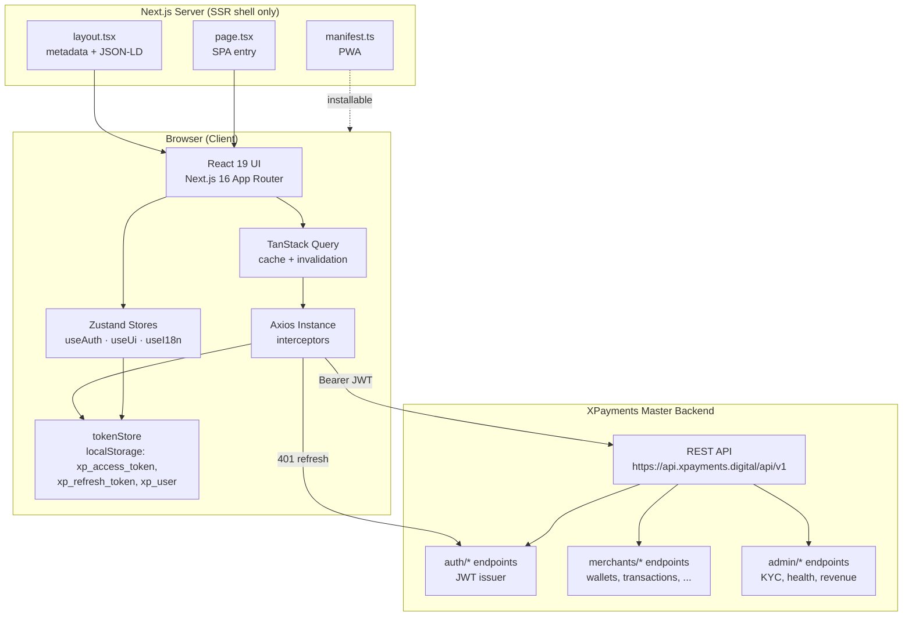
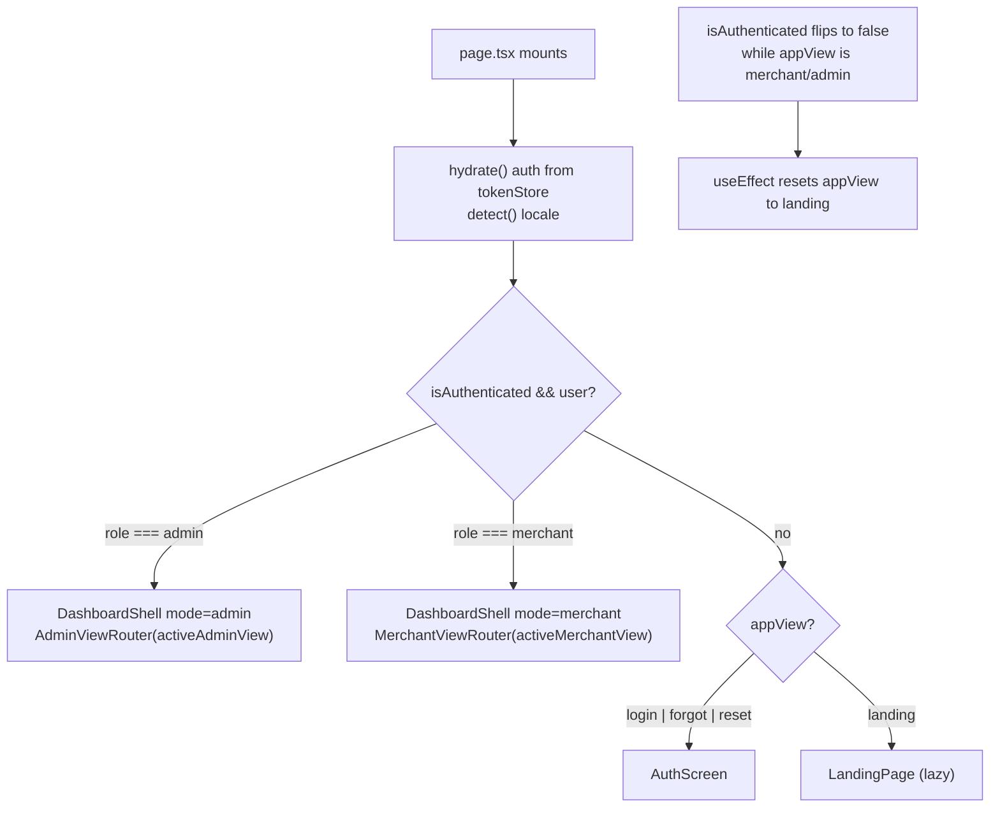
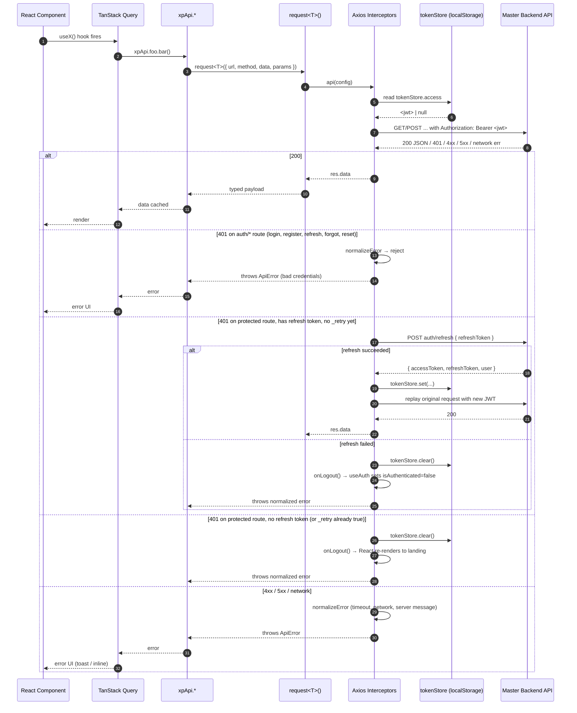
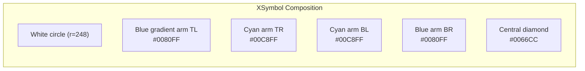
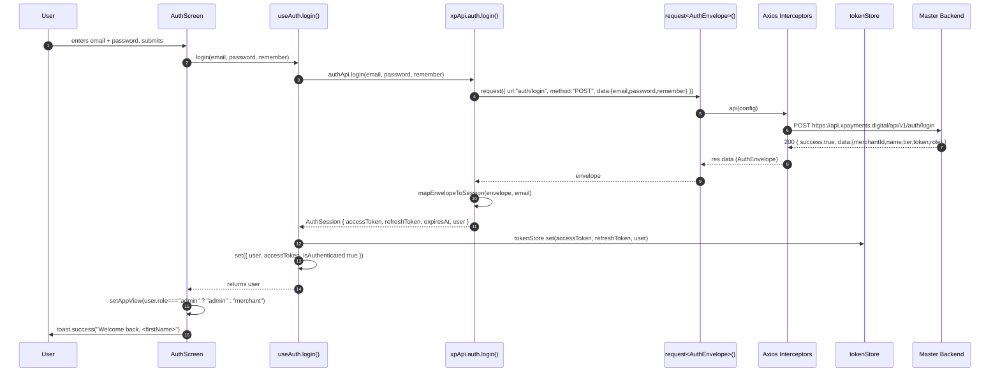
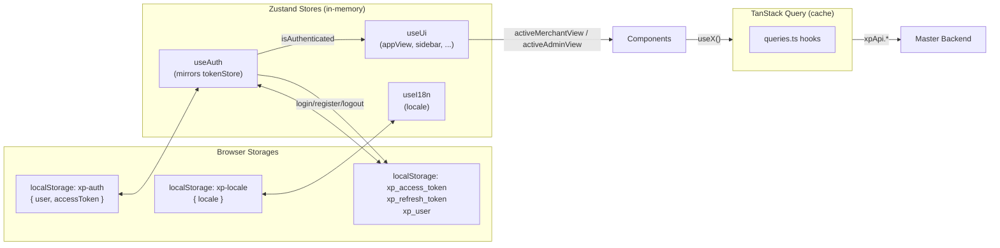

# XPayments — Technical Specification

> **Scope.** This document is the complete engineering reference for the XPayments frontend. It covers the SPA architecture, the full feature surface (18 merchant views and 15 admin views), the internationalization layer, the PWA and branding assets, and — most importantly — the complete backend API contract exposed by `src/lib/api/xpApi.ts` against the Master Backend at `https://api.xpayments.digital/api/v1`.

- **Repository:** `nexflowx-hub/xpayments.digital`
- **Frontend stack:** Next.js 16 (App Router) · React 19 · TypeScript 5 · Tailwind CSS 4 · shadcn/ui · Zustand 5 · TanStack Query 5 · Axios 1.18
- **Backend:** XPayments Master Backend (REST, JWT, JSON envelopes)
- **Status:** Frontend production-ready; backend contract frozen.
- **Document version:** 1.0

---

## Table of Contents

1. [Project Overview](#1-project-overview)
2. [Technology Stack](#2-technology-stack)
3. [Architecture](#3-architecture)
   - 3.1 High-Level Architecture
   - 3.2 Single-Route SPA Model
   - 3.3 Folder Structure
   - 3.4 Request Lifecycle
4. [Available Features](#4-available-features)
   - 4.1 Authentication & Onboarding
   - 4.2 Merchant Dashboard (18 views)
   - 4.3 Admin Platform (15 views)
   - 4.4 Internationalization
   - 4.5 PWA & Branding
   - 4.6 Design System
   - 4.7 Performance & Accessibility
5. [Backend API Connection](#5-backend-api-connection)
   - 5.1 Base Configuration
   - 5.2 Response Envelopes
   - 5.3 Authentication Flow
   - 5.4 Complete Endpoint Reference (39 endpoints)
   - 5.5 Error Handling
   - 5.6 JWT & Security
6. [State Management](#6-state-management)
7. [Environment Variables](#7-environment-variables)
8. [Getting Started](#8-getting-started)
9. [Deployment](#9-deployment)
10. [Roadmap](#10-roadmap)

---

## 1. Project Overview

XPayments is an **enterprise fintech platform** that lets merchants accept payments globally — cards (Visa, Mastercard), instant bank transfers (Pix, MBWay, Bizum, SEPA), wallet tokens (Apple Pay, Google Pay) and crypto — through a single unified REST API. Around that API the frontend ships a full operational console: multi-currency wallets, FX, treasury, real-time risk scoring, commerce tooling (stores, products, payment links, invoices, subscriptions), a developer portal (API keys, webhooks), and an admin platform for KYC, merchant management and infrastructure observability.

### 1.1 Architecture at a Glance

The frontend is a **single-route SPA** built on Next.js's App Router. There is exactly one HTML route (`/`) backed by `src/app/page.tsx`. Internal navigation — between landing, login, register, forgot, reset, the merchant dashboard and the admin platform — is driven by a small Zustand store (`useUi.appView`, `activeMerchantView`, `activeAdminView`) rather than by URL changes. Every dashboard page is a React component lazy-loaded with `next/dynamic` for code-splitting, wrapped by a shared `DashboardShell` that provides the sidebar, top bar, command palette and notifications sheet.

This design was chosen deliberately:

| Concern | Decision | Rationale |
|---|---|---|
| Routing | Single-route SPA, in-memory view state | The app is an authenticated console, not a marketing site; URL churn is undesirable, deep-linking is handled via PWA shortcuts, and the SPA model lets the auth gating live in one place (`page.tsx`). |
| Theming | **Dark-first** with Tailwind 4 + shadcn primitives | Dark surfaces are the default for fintech dashboards; light mode is supported via `next-themes`. |
| Data | TanStack Query for server state, Zustand for UI/auth state | Clear separation of cacheable server data from ephemeral client state. |
| HTTP | Axios with interceptors, **real REST only** | One centralized client (`client.ts`) owns JWT injection and the 401-refresh flow; no mock fallback in production. |
| i18n | 4 locales (EN, PT-BR, FR, ES), persisted, timezone-aware | Coverage matches primary markets (EU + Brazil). |
| PWA | Full manifest, maskable icons, offline shell | Installable on iOS/Android, shortcuts to Dashboard/Payments/Wallets. |

### 1.2 Benchmark and Positioning

XPayments positions itself as an enterprise alternative to Stripe and Adyen, with a particular strength in **emerging-market rails** (Pix, MBWay, Bizum) and crypto settlement. The marketing copy and metadata reflect this:

- 99.99% uptime SLA
- PCI DSS Level 1, SOC 2 Type II
- 42 ms median API latency
- 120+ currencies, 45 countries
- One API for "global money movement"

These claims appear verbatim in `layout.tsx` metadata and the landing-page i18n dictionaries.

### 1.3 Compliance Posture

The application is built to be deployed inside a PCI DSS Level 1 / SOC 2 Type II environment. Cardholder data is never touched by the frontend — payment methods are tokenized server-side and the frontend only ever references token identifiers, method names, and last-four digits. JWTs are stored in `localStorage` (see §5.6 for the full security discussion and trade-offs).

---

## 2. Technology Stack

Every dependency below is pinned in `package.json`. The table reflects the **exact installed version range** and the role each package plays in the application.

### 2.1 Core Framework

| Package | Version | Role |
|---|---|---|
| `next` | `^16.1.1` | App Router, RSC, metadata API, manifest, image optimization |
| `react` | `^19.0.0` | UI runtime (concurrent features, `use`, actions) |
| `react-dom` | `^19.0.0` | DOM renderer |
| `typescript` | `^5` | Type system (strict mode) |
| `tailwindcss` | `^4` | Utility-first CSS (new v4 engine, `@tailwindcss/postcss`) |
| `tailwind-merge` | `^3.3.1` | Class de-duplication (`cn()` helper) |
| `clsx` | `^2.1.1` | Conditional class composition |
| `class-variance-authority` | `^0.7.1` | Variant typing for shadcn primitives |
| `tailwindcss-animate` | `^1.0.7` | Animation utilities |
| `tw-animate-css` | `^1.3.5` | Additional animation primitives (dev) |

### 2.2 State, Data, Forms

| Package | Version | Role |
|---|---|---|
| `zustand` | `^5.0.6` | `useAuth`, `useUi`, `useI18n` stores (with `persist` middleware) |
| `@tanstack/react-query` | `^5.82.0` | Server-state cache for all `xpApi.*` calls |
| `@tanstack/react-table` | `^8.21.3` | Headless data tables (transactions, customers, admin merchants) |
| `react-hook-form` | `^7.60.0` | Login/register/settings forms |
| `@hookform/resolvers` | `^5.1.1` | Bridges RHF with schema validators |
| `zod` | `^4.0.2` | Schema validation (login, register, dynamic forms) |
| `axios` | `^1.18.1` | HTTP client + interceptors (`src/lib/api/client.ts`) |

### 2.3 UI Primitives (shadcn/ui on Radix)

| Package | Version | Role |
|---|---|---|
| `@radix-ui/react-accordion` | `^1.2.11` | Collapsible sections |
| `@radix-ui/react-alert-dialog` | `^1.1.14` | Confirmation dialogs |
| `@radix-ui/react-aspect-ratio` | `^1.1.7` | Media containers |
| `@radix-ui/react-avatar` | `^1.1.10` | User avatars (fallback initials) |
| `@radix-ui/react-checkbox` | `^1.3.2` | Form checkboxes |
| `@radix-ui/react-collapsible` | `^1.1.11` | Sidebar groups |
| `@radix-ui/react-context-menu` | `^2.2.15` | Row-level actions |
| `@radix-ui/react-dialog` | `^1.1.14` | Modal dialogs |
| `@radix-ui/react-dropdown-menu` | `^2.1.15` | User menu, workspace switcher |
| `@radix-ui/react-hover-card` | `^1.1.14` | Rich tooltips |
| `@radix-ui/react-label` | `^2.1.7` | Accessible form labels |
| `@radix-ui/react-menubar` | `^1.1.15` | Top-level menus |
| `@radix-ui/react-navigation-menu` | `^1.2.13` | Marketing nav |
| `@radix-ui/react-popover` | `^1.1.14` | Filters, pickers |
| `@radix-ui/react-progress` | `^1.1.7` | Upload/processing bars |
| `@radix-ui/react-radio-group` | `^1.3.7` | Single-choice options |
| `@radix-ui/react-scroll-area` | `^1.2.9` | Custom scrollbars |
| `@radix-ui/react-select` | `^2.2.5` | Dropdowns |
| `@radix-ui/react-separator` | `^1.1.7` | Visual dividers |
| `@radix-ui/react-slider` | `^1.3.5` | Range inputs |
| `@radix-ui/react-slot` | `^1.2.3` | `asChild` composition |
| `@radix-ui/react-switch` | `^1.2.5` | Toggles |
| `@radix-ui/react-tabs` | `^1.1.12` | Tab navigation |
| `@radix-ui/react-toast` | `^1.2.14` | Legacy toast (radix) |
| `@radix-ui/react-toggle` | `^1.1.9` | Icon toggles |
| `@radix-ui/react-toggle-group` | `^1.1.10` | Segmented controls |
| `@radix-ui/react-tooltip` | `^1.2.7` | Hover tooltips |
| `cmdk` | `^1.1.1` | Command palette (Cmd+K) |
| `sonner` | `^2.0.6` | Toast notifications (primary) |
| `vaul` | `^1.1.2` | Mobile drawer (Sheet) |
| `lucide-react` | `^0.525.0` | Icon system |
| `next-themes` | `^0.4.6` | Dark/light theme switching |
| `framer-motion` | `^12.23.2` | Animations (auth panel, page transitions) |

### 2.4 Data Visualization, Dates, Markdown

| Package | Version | Role |
|---|---|---|
| `recharts` | `^2.15.4` | Charts (revenue, volume, cashflow, risk history) |
| `date-fns` | `^4.1.0` | Date formatting, relative times |
| `react-day-picker` | `^9.8.0` | Date range pickers |
| `react-markdown` | `^10.1.0` | Render API docs / changelogs |
| `react-syntax-highlighter` | `^15.6.1` | Code blocks in API explorer |
| `@mdxeditor/editor` | `^3.39.1` | Rich text editor (support tickets, docs) |

### 2.5 Utility

| Package | Version | Role |
|---|---|---|
| `uuid` | `^11.1.0` | Client-side id generation |
| `sharp` | `^0.34.3` | Next.js image optimization |
| `input-otp` | `^1.4.2` | OTP/2FA input |
| `embla-carousel-react` | `^8.6.0` | Testimonials carousel |
| `react-resizable-panels` | `^3.0.3` | Resizable dashboard panels |
| `@dnd-kit/core`, `sortable`, `utilities` | `^6.3.1` / `^10.0.0` / `^3.2.2` | Drag-and-drop (kanban, dashboard widgets) |
| `@reactuses/core` | `^6.0.5` | Extra React hooks |

### 2.6 Auth, i18n, Backend, AI

| Package | Version | Role |
|---|---|---|
| `next-auth` | `^4.24.11` | Available for OAuth providers (currently using custom JWT) |
| `next-intl` | `^4.3.4` | Reserved for SSG i18n routing (current app uses custom dictionaries) |
| `@prisma/client` | `^6.11.1` | Local dev DB client |
| `prisma` | `^6.11.1` | Schema/migrations (local dev tooling only) |
| `z-ai-web-dev-sdk` | `^0.0.18` | In-app AI helpers (content drafts, summaries) |

### 2.7 Build, Lint, Types

| Package | Version | Role |
|---|---|---|
| `eslint` | `^9` | Linter |
| `eslint-config-next` | `^16.1.1` | Next.js lint rules |
| `@types/react`, `@types/react-dom` | `^19` | React type definitions |
| `bun-types` | `^1.3.4` | Bun runtime types (production server) |
| `@tailwindcss/postcss` | `^4` | Tailwind PostCSS plugin |

### 2.8 Scripts (`package.json`)

```jsonc
{
  "dev":      "next dev -p 3000 2>&1 | tee dev.log",
  "build":    "next build && cp -r .next/static .next/standalone/.next/ && cp -r public .next/standalone/",
  "start":    "NODE_ENV=production bun .next/standalone/server.js 2>&1 | tee server.log",
  "lint":     "eslint .",
  "db:push":     "prisma db push",
  "db:generate": "prisma generate",
  "db:migrate":  "prisma migrate dev",
  "db:reset":    "prisma migrate reset"
}
```

**Notes:**
- `dev` runs Next.js on port 3000 and tees output to `dev.log` for debugging.
- `build` produces a **standalone** Next.js bundle (`.next/standalone/server.js`) by copying the static and `public/` assets into it. This is what `start` runs.
- `start` runs the production server with **Bun** for performance.
- The `db:*` scripts operate on a local SQLite database (`DATABASE_URL=file:./db/custom.db`) used only by dev tooling — the production app does not touch Prisma at runtime.

---

## 3. Architecture

### 3.1 High-Level Architecture



**Key invariants:**

1. `tokenStore` (localStorage) is the **single source of truth** for the JWT. The Axios request interceptor reads `tokenStore.access` on every request.
2. Zustand `useAuth` mirrors `tokenStore` into React state but deliberately does **not** persist `isAuthenticated` — it is re-derived from `tokenStore.user && tokenStore.access` on every page load (see §3.4 and §5.6).
3. TanStack Query is the only layer that talks to `xpApi.*`; components never call `request<T>` directly.
4. The Next.js server (`layout.tsx`, `manifest.ts`) is responsible only for static metadata, PWA manifest and the JSON-LD structured data — it does not handle auth or proxy API calls.

### 3.2 Single-Route SPA Model

The application is a single-route SPA. The browser URL **never changes** during navigation (except for hash links on the landing page). All view transitions are managed by three pieces of state in the `useUi` Zustand store:

```ts
interface UiState {
  appView: AppView;             // "landing" | "login" | "forgot" | "reset" | "merchant" | "admin"
  activeMerchantView: string;   // one of 18 merchant view IDs
  activeAdminView: string;      // one of 15 admin view IDs
  // ...sidebar, command palette, notifications
}
```

The single entry point — `src/app/page.tsx` — reads these states plus `useAuth.isAuthenticated` and decides what to render:



#### 3.2.1 Code-Split View Router

Every merchant and admin view is loaded lazily through `next/dynamic`:

```ts
const lazy = (loader: () => Promise<{ default: React.ComponentType }>) =>
  dynamic(loader, { loading: () => <PageFallback />, ssr: false });

const merchantPages: Record<string, React.ComponentType> = {
  dashboard:      lazy(() => import("@/components/merchant/dashboard")),
  analytics:      lazy(() => import("@/components/merchant/analytics")),
  risk:           lazy(() => import("@/components/merchant/risk")),
  payments:       lazy(() => import("@/components/merchant/payments")),
  wallets:        lazy(() => import("@/components/merchant/wallets")),
  fx:             lazy(() => import("@/components/merchant/fx")),
  treasury:       lazy(() => import("@/components/merchant/treasury")),
  stores:         lazy(() => import("@/components/merchant/stores")),
  products:       lazy(() => import("@/components/merchant/products")),
  customers:      lazy(() => import("@/components/merchant/customers")),
  subscriptions:  lazy(() => import("@/components/merchant/subscriptions")),
  "payment-links":lazy(() => import("@/components/merchant/payment-links")),
  invoices:       lazy(() => import("@/components/merchant/invoices")),
  developers:     lazy(() => import("@/components/merchant/developers")),
  "api-keys":     lazy(() => import("@/components/merchant/api-keys")),
  webhooks:       lazy(() => import("@/components/merchant/webhooks")),
  settings:       lazy(() => import("@/components/merchant/settings")),
  support:        lazy(() => import("@/components/merchant/support")),
};
```

Benefits:

- Each view ships as its own JS chunk; only the active view is downloaded.
- `ssr: false` keeps the dashboard entirely client-side — there is no benefit to SSR for an authenticated console, and avoiding it prevents token-store access during SSR (which would crash because `localStorage` is undefined on the server).
- A `PageFallback` skeleton is shown during chunk download for a perceived-instant transition.

#### 3.2.2 The `appView` State Machine

| `appView` | Rendered component | Reachable when |
|---|---|---|
| `landing` | `<LandingPage />` (lazy) | Guest, initial state |
| `login` | `<AuthScreen />` (login tab) | Guest clicks "Sign in" |
| `forgot` | `<AuthScreen />` (forgot form) | Guest clicks "Forgot?" |
| `reset` | `<AuthScreen />` (reset form) | Guest follows reset email link |
| `merchant` | `<DashboardShell mode="merchant" />` | Authenticated, `user.role === "merchant"` |
| `admin` | `<DashboardShell mode="admin" />` | Authenticated, `user.role === "admin"` |

When `isAuthenticated` flips to `false` while `appView` is `"merchant"` or `"admin"`, a `useEffect` in `page.tsx` resets `appView` to `"landing"`, which avoids a flash of an unauthenticated dashboard.

### 3.3 Folder Structure

```
my-project/
├── .env.example                 # documented env vars (see §7)
├── package.json                 # dependencies + scripts (see §2)
├── next.config.*                # Next.js config (standalone output)
├── tailwind.config.*            # Tailwind 4 (CSS-first config in globals.css)
├── tsconfig.json                # path alias `@/*` → `src/*`
├── public/
│   ├── favicon.svg              # X symbol (monochrome variant)
│   ├── favicon-32.png           # 32×32 PNG
│   ├── icon-192.png             # PWA icon (any purpose)
│   ├── icon-512.png             # PWA icon (any purpose)
│   ├── icon-maskable-192.png    # PWA icon (maskable)
│   ├── icon-maskable-512.png    # PWA icon (maskable)
│   ├── apple-touch-icon.png     # 180×180 Apple touch icon
│   └── og-image.png             # OpenGraph / Twitter card (1200×630)
└── src/
    ├── app/
    │   ├── layout.tsx           # root layout, metadata, JSON-LD, providers
    │   ├── page.tsx             # SPA entry — gates on useAuth + useUi
    │   ├── manifest.ts          # PWA manifest (see §4.5)
    │   └── globals.css          # Tailwind 4 theme tokens + utilities
    ├── config/
    │   └── index.ts             # merchantNav, adminNav, PAYMENT_METHODS,
    │                            # CURRENCIES, COUNTRY_LIST, APP_NAME,
    │                            # API_BASE_URL
    ├── hooks/
    │   └── queries.ts           # TanStack Query hooks (see §6)
    ├── lib/
    │   ├── api/
    │   │   ├── client.ts        # Axios instance, tokenStore, interceptors,
    │   │   │                    # request<T>, normalizeError
    │   │   └── xpApi.ts         # all 39 endpoints + mapEnvelopeToSession
    │   ├── i18n/
    │   │   ├── index.ts         # useI18n, useT, useLocale (persisted)
    │   │   └── locales.ts       # 4 dictionaries + locale detection helpers
    │   └── utils.ts             # cn(), initials(), formatters
    ├── providers/
    │   └── app-providers.tsx    # React Query + theme + tooltip providers
    ├── stores/
    │   ├── auth.ts              # useAuth (login/register/logout/hydrate/hasRole)
    │   └── ui.ts                # useUi (appView, sidebar, command palette)
    ├── types/
    │   └── index.ts             # domain model (User, AuthEnvelope, Wallet, ...)
    └── components/
        ├── admin/               # 15 admin views (see §4.3)
        ├── auth/
        │   └── auth-screen.tsx  # login/register/forgot/reset screen
        ├── dashboard/
        │   ├── shell.tsx        # sidebar + topbar + command palette + notifications
        │   └── view-router.tsx  # lazy view registry (merchant + admin)
        ├── landing/
        │   └── landing-page.tsx # marketing page (lazy-loaded)
        ├── merchant/            # 18 merchant views (see §4.2)
        ├── shared/
        │   ├── x-symbol.tsx     # official XPayments logo (SVG)
        │   ├── payment-logos.tsx# 9 payment method SVGs + registry
        │   └── language-switcher.tsx
        └── ui/                  # shadcn primitives (button, input, dialog, ...)
```

### 3.4 Request Lifecycle

Every HTTP request flows through the same pipeline:



#### 3.4.1 The `tokenStore` — Source of Truth

```ts
const STORAGE = {
  access:  "xp_access_token",
  refresh: "xp_refresh_token",
  user:    "xp_user",
};

export const tokenStore = {
  get access() { /* localStorage.getItem("xp_access_token") */ },
  get refresh() { /* localStorage.getItem("xp_refresh_token") */ },
  get user() {
    const raw = localStorage.getItem("xp_user");
    if (!raw) return null;
    try { return JSON.parse(raw); }
    catch { localStorage.removeItem("xp_user"); return null; } // defensive
  },
  set(access, refresh, user) { /* setItem ×3 */ },
  clear() { /* removeItem ×3 */ },
};
```

All three keys are stored under fixed names. The `user` getter is **defensive**: if `localStorage` somehow contains a corrupt JSON blob (older browser bug, manual edit, migration drift), it silently removes the entry and returns `null` instead of throwing — a throw at module load would crash the entire client bundle.

#### 3.4.2 Request Interceptor

```ts
api.interceptors.request.use((config) => {
  const token = tokenStore.access;
  if (token) {
    config.headers.set("Authorization", `Bearer ${token}`);
  }
  return config;
});
```

Every request — including the refresh request itself? No: the refresh request is sent through a **raw `axios.post`** (not the `api` instance), so it does not loop back through the interceptor. This avoids an infinite refresh loop.

#### 3.4.3 Response Interceptor (401 handling)

The response interceptor implements three branches:

1. **Auth routes propagate 401.** If the URL contains `auth/login`, `auth/register`, `auth/refresh`, `auth/forgot`, or `auth/reset`, a 401 means "bad credentials" and is **not** retried — it is normalized and rejected so the auth screen can show the error.
2. **Protected routes with a refresh token attempt one refresh.** If `error.response.status === 401`, the request has not already been retried (`!original._retry`), and a refresh token exists, the interceptor performs a single-flight refresh:
   - Sets `isRefreshing = true` to deduplicate concurrent 401s.
   - POSTs to `auth/refresh` with `{ refreshToken }`.
   - On success, calls `tokenStore.set(...)` with the new tokens and **replays the original request** through `api(original)`.
   - On failure, calls `forceLogout()` (clears `tokenStore` and invokes `onLogout`), then rejects.
3. **All other 401s on protected routes** call `forceLogout()` and reject.

#### 3.4.4 `forceLogout` — No Hard Redirect

```ts
function forceLogout() {
  tokenStore.clear();
  onLogout?.();  // wired by useAuth at module load
}
```

`onLogout` is registered by `useAuth`:

```ts
registerLogoutHandler(() => {
  set({ user: null, accessToken: null, isAuthenticated: false, isLoading: false });
});
```

The result is that React re-renders with `isAuthenticated === false`, and the `useEffect` in `page.tsx` resets `appView` to `"landing"`. There is **no `window.location.href = "/login"`** — this avoids a full page reload, preserves the SPA state, and prevents redirect loops during transient 401 storms.

#### 3.4.5 `normalizeError` — Unified `ApiError`

Every error that reaches application code is normalized into the `ApiError` shape:

```ts
interface ApiError {
  message: string;
  code?: string;
  status?: number;
  details?: Record<string, unknown>;
}
```

| Condition | Result |
|---|---|
| `err.code === "ECONNABORTED"` | `{ message: "Request timed out…", code: "ECONNABORTED", status: 0 }` |
| `err.code === "ERR_NETWORK"` | `{ message: "Network error…", code: "ERR_NETWORK", status: 0 }` |
| Axios 4xx/5xx with body | `{ message: data.message || data.error || err.message, code: data.code, status: err.response.status, details: data.details }` |
| Non-Axios throw | `{ message: "Unexpected error", status: 500 }` |

Application code can therefore rely on `err.message` always being present and on `err.status` being numeric (with `0` meaning "never reached the server").

---

## 4. Available Features

### 4.1 Authentication & Onboarding

The auth flow is implemented in `src/components/auth/auth-screen.tsx` and `src/stores/auth.ts`. It supports five modes gated by `useUi.appView`: `login`, `register`, `forgot`, `reset`, plus the branded panel and language switcher.

#### 4.1.1 Login

- **Form:** email + password + "Remember me for 30 days" checkbox.
- **Validation:** Zod schema — `email: z.string().email()`, `password: z.string().min(6)`.
- **Demo credentials (pre-filled):** `merchant@xpayments.digital` / `demo1234`. An admin demo (`admin@xpayments.digital` / `demo1234`) is shown in a bordered demo-credentials card.
- **Submission:** `useAuth.login(email, password, remember)` → `xpApi.auth.login` → POST `auth/login` → `mapEnvelopeToSession` → `tokenStore.set` → `useAuth.set({ user, accessToken, isAuthenticated: true })` → `setAppView("merchant" | "admin")` based on role.
- **Success toast:** `Welcome back, <firstName>`.
- **Failure:** toast `Sign in failed` with description; `isLoading` resets.

#### 4.1.2 Register

- **Form:** full name, email, organization/store name, password, terms acceptance (must be `true`).
- **Validation:** Zod — name `min(2)`, email `email()`, password `min(8)`, companyName `min(2)`, terms `z.literal(true)`.
- **Submission:** `useAuth.register({ name, email, password, companyName })` → POST `auth/register` → same envelope mapping as login.
- **Success toast:** `Account created` / `Welcome to XPayments — your merchant workspace is ready.`
- **Failure:** toast `Registration failed`.

#### 4.1.3 Forgot Password

- **Form:** email only.
- **Submission:** POST `auth/forgot` (via `xpApi.auth.forgot`). On success: toast `Reset link sent`, return to login.
- Currently the screen uses a placeholder `setTimeout(800ms)` for UX feedback in addition to the API call.

#### 4.1.4 Reset Password

- **Form:** email (token is supplied via the reset link).
- **Submission:** POST `auth/reset` with `{ token, password }`.

#### 4.1.5 JWT, Roles, and Session

- **Roles:** `"merchant" | "admin" | "guest"` (defined in `UserRole`).
- After login/register, `mapEnvelopeToSession` constructs a `User` object:
  ```ts
  const user: User = {
    id: d.merchantId,        // merchantId from envelope becomes user.id
    name: d.name,
    email,                   // passed through from the form (envelope doesn't include it)
    role: (d.role || "merchant") as UserRole,
    merchantId: d.merchantId,
    tier: d.tier,
  };
  ```
- The session is stored to `tokenStore` (`xp_access_token`, `xp_refresh_token`, `xp_user`).
- `isAuthenticated` is **not persisted** in Zustand — it is re-derived on every page load via `getInitialAuth()` reading `tokenStore.user && tokenStore.access`.
- The `useAuth.hasRole(...roles)` helper gates UI elements (e.g., admin-only nav).

#### 4.1.6 Language Switcher

A `<LanguageSwitcher />` is mounted in the auth screen top-right and in the dashboard top bar. It cycles between the 4 supported locales (see §4.4) and persists the choice in `localStorage` under `xp-locale`.

### 4.2 Merchant Dashboard (18 Views)

The merchant dashboard is rendered by `<DashboardShell mode="merchant">` and contains 18 views organized into 5 nav sections. Every view is a separate file in `src/components/merchant/` and is lazy-loaded by `view-router.tsx`.

| # | View ID | File | Nav Section | Description | Primary API Endpoint(s) |
|---|---|---|---|---|---|
| 1 | `dashboard` | `dashboard.tsx` | Overview | KPI overview: revenue, volume, conversion, approval rate, risk score; revenue/volume sparklines; payment method mix; realtime feed | `GET merchants/analytics` |
| 2 | `analytics` | `analytics.tsx` | Overview | Deep-dive analytics: revenue/volume series, payment method distribution, currency distribution, top customers by LTV | `GET merchants/analytics` |
| 3 | `risk` | `risk.tsx` | Overview | Risk center: trust status, score history, alerts (low/med/high/critical), recommendations, chargeback rate, reserve % | `GET merchants/risk/profile` |
| 4 | `payments` | `payments.tsx` | Money Movement | Transactions table with filters (search, status, country, currency, method, gateway, date range, sort) and row-level detail drawer with event timeline | `GET merchants/transactions`, `GET merchants/transactions/{id}` |
| 5 | `wallets` | `wallets.tsx` | Money Movement | Multi-currency wallet cards (EUR, USD, BRL, GBP, USDT, BTC) with balance, available, reserved; movements ledger; deposit / payout / swap actions | `GET merchants/wallets`, `GET merchants/wallets/movements`, `POST merchants/wallets/{swap,deposit,payout}` |
| 6 | `fx` | `fx.tsx` | Money Movement | FX converter: choose source/target currency, amount, see rate, confirm swap | `POST merchants/wallets/swap` |
| 7 | `treasury` | `treasury.tsx` | Money Movement | Treasury overview: total liquidity, reserve, pending payouts, net flow; cashflow series (inflow/outflow); settlement series; per-currency balances | `GET merchants/treasury` |
| 8 | `stores` | `stores.tsx` | Commerce | List of merchant stores with status (active/paused/draft), product count, revenue, currency | `GET merchants/stores` |
| 9 | `products` | `products.tsx` | Commerce | Product catalog: name, price, currency, stock, sales; create / delete | `GET merchants/products`, `POST merchants/products`, `DELETE merchants/products/{id}` |
| 10 | `customers` | `customers.tsx` | Commerce | Customer list with LTV, avg order, orders count, segment (vip/regular/new/at_risk), status | `GET merchants/customers` |
| 11 | `subscriptions` | `subscriptions.tsx` | Commerce | Recurring subscriptions: customer, plan, amount, currency, status (active/trialing/past_due/canceled), interval, current period end | `GET merchants/subscriptions` |
| 12 | `payment-links` | `payment-links.tsx` | Commerce | Hosted payment links: name, URL, amount, currency, status, visits, conversions | `GET merchants/payment-links` |
| 13 | `invoices` | `invoices.tsx` | Commerce | Invoices: number, customer, amount, currency, status (paid/open/overdue/draft/void), due date | `GET merchants/invoices` |
| 14 | `developers` | `developers.tsx` | Developers | Developer portal landing: SDK install snippet, sample request/response, feature highlights | (static + `GET api-keys` for environment switcher) |
| 15 | `api-keys` | `api-keys.tsx` | Developers | API key management: list (name, prefix, last four, scopes, environment live/test, last used), create (with environment + scopes), revoke | `GET api-keys`, `POST api-keys`, `DELETE api-keys/{id}` |
| 16 | `webhooks` | `webhooks.tsx` | Developers | Webhook endpoints: URL, events subscribed, status, secret, last delivery, success rate; create / delete | `GET merchants/webhooks`, `POST merchants/webhooks`, `DELETE merchants/webhooks/{id}` |
| 17 | `settings` | `settings.tsx` | System | Merchant settings: profile (name, email, avatar), company, security (2FA toggle, password), notifications | (uses `auth/me` for profile; settings are largely local) |
| 18 | `support` | `support.tsx` | System | Support center: ticket composer (MDX editor), recent tickets, contact channels | (local compose; future: `POST merchants/support/tickets`) |

#### 4.2.1 Sidebar Sections (Merchant)

```ts
merchantNav = [
  { id: "overview",  items: [dashboard, analytics, risk] },
  { id: "money",     items: [payments, wallets, fx, treasury] },
  { id: "commerce",  items: [stores, products, customers, subscriptions,
                             payment-links, invoices] },
  { id: "developers",items: [developers, api-keys, webhooks] },
  { id: "system",    items: [settings, support] },
];
```

### 4.3 Admin Platform (15 Views)

The admin platform is rendered by `<DashboardShell mode="admin">` and contains 15 views organized into 3 nav sections. Every view is a separate file in `src/components/admin/`.

| # | View ID | File | Nav Section | Description | Primary API Endpoint(s) |
|---|---|---|---|---|---|
| 1 | `admin-dashboard` | `admin-dashboard.tsx` | Platform | Platform overview: total merchants, processed volume, revenue, system status, KYC queue depth, top merchants | `GET admin/merchants`, `GET admin/revenue`, `GET admin/health` |
| 2 | `admin-merchants` | `admin-merchants.tsx` | Platform | Merchant list: name, email, country, status (active/frozen/suspended/pending), risk score, revenue, volume, KYC status; row action to set status | `GET admin/merchants`, `POST admin/merchants/{id}/status` |
| 3 | `admin-kyc` | `admin-kyc.tsx` | Platform | KYC review queue: merchant name, country, submitted date, documents (passport, id_card, selfie, address_proof, article), risk flags; approve / reject | `GET admin/kyc`, `POST admin/kyc/{id}/{approved|rejected}` |
| 4 | `admin-treasury` | `admin-treasury.tsx` | Platform | Platform-wide treasury: total liquidity, reserve, pending payouts, net flow, per-currency balances, cashflow series | `GET admin/treasury/overview` |
| 5 | `admin-revenue` | `admin-revenue.tsx` | Platform | Revenue analytics: total + time series, breakdowns by gateway, currency, region | `GET admin/revenue` |
| 6 | `admin-gateways` | `admin-gateways.tsx` | Operations | Gateway configuration: list of connected processors (Visa, Mastercard, Pix, etc.) with status, latency, enabled methods | (local config; future: `GET admin/gateways`) |
| 7 | `admin-risk` | `admin-risk.tsx` | Operations | Platform risk: aggregate risk score, alerts, fraud trends, chargeback monitoring | (uses merchant risk endpoint shape; future: `GET admin/risk`) |
| 8 | `admin-analytics` | `admin-analytics.tsx` | Operations | Platform analytics: volume across all merchants, payment method distribution, regional heatmap | (derived from `admin/revenue` + `admin/merchants`) |
| 9 | `admin-support` | `admin-support.tsx` | Operations | Support inbox: merchant tickets, priority, status, assignee | (local; future: `GET admin/support/tickets`) |
| 10 | `admin-health` | `admin-health.tsx` | Infrastructure | System health: status (operational/degraded/outage), uptime, services list with latency, queues, workers | `GET admin/health` |
| 11 | `admin-workers` | `admin-workers.tsx` | Infrastructure | Background worker fleet: active/idle count per worker, region | (subset of `admin/health` workers array) |
| 12 | `admin-queues` | `admin-queues.tsx` | Infrastructure | Job queues: pending, processing, throughput per queue | (subset of `admin/health` queues array) |
| 13 | `admin-logs` | `admin-logs.tsx` | Infrastructure | Audit + system logs: searchable, filterable by level/source | (local; future: `GET admin/logs`) |
| 14 | `admin-flags` | `admin-flags.tsx` | Infrastructure | Feature flags: list, toggle, environment scoping | (local; future: `GET/POST admin/flags`) |
| 15 | `admin-compliance` | `admin-compliance.tsx` | Infrastructure | Compliance center: PCI DSS, SOC 2, AML/KYC policy status; document vault | (local; future: `GET admin/compliance`) |

#### 4.3.1 Sidebar Sections (Admin)

```ts
adminNav = [
  { id: "platform", items: [admin-dashboard, admin-merchants, admin-kyc,
                            admin-treasury, admin-revenue] },
  { id: "ops",      items: [admin-gateways, admin-risk, admin-analytics,
                            admin-support] },
  { id: "infra",    items: [admin-health, admin-workers, admin-queues,
                            admin-logs, admin-flags, admin-compliance] },
];
```

A badge `"7"` is rendered on the `admin-kyc` nav item to indicate the queue depth (visible at a glance).

### 4.4 Internationalization

XPayments ships with **4 locales** out of the box. The system is custom (not `next-intl` routing-based) to fit the single-route SPA model.

| Code | Label | Native | Flag |
|---|---|---|---|
| `en` | English | English | 🇺🇸 |
| `pt-BR` | Português (Brasil) | Português | 🇧🇷 |
| `fr` | Français | Français | 🇫🇷 |
| `es` | Español | Español | 🇪🇸 |

#### 4.4.1 Locale Detection

`useI18n.detect()` runs on mount in `page.tsx` and applies the following resolution:

1. **Browser language** — `navigator.language` (or `navigator.languages[0]`). `resolveBrowserLocale()` maps `pt*` → `pt-BR`, `fr*` → `fr`, `es*` → `es`, everything else → `en`.
2. **Timezone fallback** — if the browser language resolves to `en` (or is missing), `localeFromTimezone()` consults a static `tzCountry` map for known Portuguese, French and Spanish timezones (`America/Sao_Paulo`, `Europe/Paris`, `Europe/Madrid`, etc.).
3. **Default** — `en`.

The chosen locale is persisted to `localStorage` under `xp-locale` and rehydrated on subsequent loads.

#### 4.4.2 Translation Hook

```ts
export function useT() {
  const locale = useI18n((s) => s.locale);
  return (key: string): string => {
    const dict = dictionaries[locale] ?? dictionaries.en;
    return dict[key] ?? dictionaries.en[key] ?? key;  // fallback chain
  };
}
```

The fallback chain is **current locale → English → raw key**, so a missing translation never crashes — at worst the user sees the English string or the key itself (which signals to developers that a translation is missing).

#### 4.4.3 Dictionary Coverage

Each dictionary contains 300+ keys spanning:

- `common.*` — generic verbs (sign in, save, cancel, copy, view all)
- `nav.*` — navigation labels
- `hero.*`, `pm.*`, `dev.*`, `features.*`, `security.*`, `testimonials.*`, `cta.*`, `footer.*` — landing page sections
- `auth.*` — login/register/forgot/reset
- `shell.*` — dashboard chrome (workspace, notifications, signout, profile)
- `cmd.*` — command palette
- `sec.*` — sidebar section headers
- Per-view keys (`dashboard.*`, `wallets.*`, `payments.*`, etc.)

#### 4.4.4 SEO & hreflang

`layout.tsx` exposes the locale variants as `alternates.languages`:

```ts
alternates: {
  canonical: SITE_URL,
  languages: {
    "en":         SITE_URL,
    "pt-BR":      `${SITE_URL}/?lang=pt-BR`,
    "fr":         `${SITE_URL}/?lang=fr`,
    "es":         `${SITE_URL}/?lang=es`,
    "x-default":  SITE_URL,
  },
},
openGraph: {
  locale: "en_US",
  alternateLocale: ["pt_BR", "fr_FR", "es_ES"],
},
```

### 4.5 PWA & Branding

#### 4.5.1 PWA Manifest

`src/app/manifest.ts` generates `/manifest.webmanifest` with:

| Field | Value |
|---|---|
| `name` | `XPayments — Enterprise Payments Infrastructure` |
| `short_name` | `XPayments` |
| `description` | `XPayments is the enterprise fintech platform for global payments, FX, treasury and risk. Accept cards, Pix, MBWay and crypto with one API.` |
| `id`, `start_url`, `scope` | `/` |
| `display` | `standalone` (with `display_override: ["standalone", "minimal-ui"]`) |
| `orientation` | `any` |
| `theme_color`, `background_color` | `#0B1220` (dark) |
| `categories` | `["finance", "business", "productivity", "developer"]` |
| `lang` | `en`, `dir` | `ltr` |

**Icons:**

| Source | Size | Purpose |
|---|---|---|
| `/favicon.svg` | any | any |
| `/icon-192.png` | 192×192 | any |
| `/icon-512.png` | 512×512 | any |
| `/icon-maskable-192.png` | 192×192 | maskable |
| `/icon-maskable-512.png` | 512×512 | maskable |

**Shortcuts** (long-press / right-click on the installed app icon):

| Name | URL |
|---|---|
| Dashboard | `/?view=dashboard` |
| Payments | `/?view=payments` |
| Wallets | `/?view=wallets` |

#### 4.5.2 Apple Web App

`layout.tsx` configures `appleWebApp`:

```ts
appleWebApp: {
  capable: true,
  title: "XPayments",
  statusBarStyle: "black-translucent",
  startupImage: ["/apple-touch-icon.png"],
}
```

#### 4.5.3 The XPayments Logo — `<XSymbol />`

The official brand mark is implemented in `src/components/shared/x-symbol.tsx` as inline SVG. It renders transparent so the white circular emblem shows on any background.

**Composition (viewBox `0 0 512 512`):**

1. **Circular white emblem** — `<circle cx="256" cy="256" r="248" fill="#FFFFFF" />` plus a subtle radial shadow gradient for depth.
2. **Four triangular arms** forming a stylized "X":
   - Top-left arm: `fill="#0080FF"` (vibrant blue)
   - Top-right arm: `fill="#00C8FF"` (bright cyan)
   - Bottom-left arm: `fill="#00C8FF"`
   - Bottom-right arm: `fill="#0080FF"`
3. **Central diamond** — `points="256,224 288,256 256,288 224,256"` with `fill="#0066CC"` (darker blue).

An optional `withRing` prop renders a thin outer `#F0F0F0` ring for high-contrast contexts.



#### 4.5.4 Payment Method Logos

`src/components/shared/payment-logos.tsx` ships **9 official payment-method SVG logos** plus a generic `bank_transfer` mark. Each is a faithful (or carefully reconstructed) version of the brand's official artwork, with dark-surface legibility adjustments:

| Method | Logo Component | Brand Color | Notes |
|---|---|---|---|
| Visa | `VisaLogo` | `#3B82F6` | Brightened from native `#1A1F71` for dark surfaces |
| Mastercard | `MastercardLogo` | `#EB001B` | Native two-overlapping-circles mark |
| Pix | `PixLogo` | `#00B89C` | Brightened teal from native `#77B6A8` |
| Apple Pay | `ApplePayLogo` | `#FFFFFF` | Native paths |
| Google Pay | `GooglePayLogo` | `#4285F4` / `#34A853` / `#FBBC04` / `#EA4335` | Faithful multi-color recreation |
| MBWay | `MBWayLogo` | `#E60000` | Native red badge + white wordmark |
| Bizum | `BizumLogo` | `#05C0C7` | Native teal wordmark |
| Crypto | `CryptoLogo` | `#F7931A` | Bitcoin-style coin (representative) |
| SEPA | `SepaLogo` | `#003399` | White wordmark on EU blue stripe |
| Bank transfer | `BankTransferLogo` | `#94A3B8` | Generic bank facade |

A registry is exported for runtime lookup:

```ts
export const PAYMENT_LOGOS: Record<string, React.ComponentType<LogoProps>> = {
  visa, mastercard, apple_pay, google_pay, pix, mbway,
  bizum, crypto, sepa, bank_transfer,
};

export function PaymentLogo({ method, className }) {
  const Cmp = PAYMENT_LOGOS[method];
  if (!Cmp) return null;
  return <Cmp className={className} />;
}
```

The default render height is `h-5` (20 px); pass `className` to override.

#### 4.5.5 Theme Colors

| Context | Color |
|---|---|
| Manifest `theme_color` | `#0B1220` |
| Manifest `background_color` | `#0B1220` |
| Viewport dark `theme-color` | `#0B1220` |
| Viewport light `theme-color` | `#FFFFFF` |
| Primary (logo blue) | `#0080FF` |
| Accent (logo cyan) | `#00C8FF` |
| Logo central diamond | `#0066CC` |

### 4.6 Design System

#### 4.6.1 Theme

The design system is **dark-first**, built on Tailwind CSS 4 with shadcn/ui primitives. The theme tokens are defined in `src/app/globals.css` using the CSS-first Tailwind 4 syntax. Light mode is supported via `next-themes` (mounted in the dashboard top bar with Sun/Moon toggle).

- **Fonts:** Geist Sans (`--font-geist-sans`) and Geist Mono (`--font-geist-mono`) loaded via `next/font/google` with `display: swap`.
- **Color tokens:** `background`, `foreground`, `card`, `popover`, `primary`, `secondary`, `muted`, `accent`, `destructive`, `border`, `input`, `ring`, `sidebar` — all defined as CSS variables that swap between dark and light.
- **Radius:** CSS variable `--radius` drives all shadcn components.
- **Custom utilities:** `bg-radial-blue`, `bg-grid`, `mask-fade-b`, `scrollbar-thin`, `safe-top` — composed for the auth branded panel, hero and mobile safe areas.

#### 4.6.2 Shared Components

| Component | Location | Purpose |
|---|---|---|
| `XSymbol` | `shared/x-symbol.tsx` | Official logo (see §4.5.3) |
| `PaymentLogo` + 10 logos | `shared/payment-logos.tsx` | Payment marks (see §4.5.4) |
| `LanguageSwitcher` | `shared/language-switcher.tsx` | Locale dropdown |
| `DashboardShell` | `dashboard/shell.tsx` | Sidebar + topbar + command palette + notifications |
| `MerchantViewRouter` | `dashboard/view-router.tsx` | Lazy view registry (merchant) |
| `AdminViewRouter` | `dashboard/view-router.tsx` | Lazy view registry (admin) |
| `AuthScreen` | `auth/auth-screen.tsx` | Login/register/forgot/reset |
| `LandingPage` | `landing/landing-page.tsx` | Marketing page (lazy) |

#### 4.6.3 shadcn Primitives

The `components/ui/` directory contains the full shadcn/ui kit: `accordion`, `alert-dialog`, `aspect-ratio`, `avatar`, `badge`, `button`, `card`, `checkbox`, `collapsible`, `command`, `context-menu`, `dialog`, `drawer`, `dropdown-menu`, `form`, `hover-card`, `input`, `input-otp`, `label`, `menubar`, `navigation-menu`, `popover`, `progress`, `radio-group`, `scroll-area`, `select`, `separator`, `sheet`, `skeleton`, `slider`, `sonner`, `switch`, `table`, `tabs`, `textarea`, `toast`, `toaster`, `toggle`, `toggle-group`, `tooltip`. All consume the theme tokens and are responsive by default.

### 4.7 Performance & Accessibility

#### 4.7.1 Performance

- **Code-splitting:** every merchant and admin view is a separate lazy chunk (33 chunks total). The initial bundle contains only the landing page + auth screen + shell.
- **Standalone build:** `next build` produces a self-contained `.next/standalone/server.js` runnable with Bun — minimal cold start.
- **Font optimization:** `next/font/google` with `display: swap` and CSS variables avoids FOUT.
- **Image optimization:** `sharp` is installed for Next.js image processing.
- **Skeleton fallbacks:** `PageFallback` (skeleton grid) is shown during chunk load, preventing layout shift.
- **Single-flight refresh:** concurrent 401s deduplicate into one refresh request.
- **Query cache:** TanStack Query caches GET responses and supports `invalidateQueries` after mutations (see §6).

#### 4.7.2 Accessibility

- **Semantic HTML:** `role="img"` with `aria-label` on every logo SVG (e.g., `aria-label="XPayments"`, `aria-label="Visa"`).
- **Keyboard navigation:** `Cmd+K` opens the command palette; `Esc` closes dialogs and sheets; sidebar items are reachable by Tab.
- **Form labels:** every input has an associated `<label>` (via Radix Label).
- **Focus management:** Radix primitives manage focus trap and restore in dialogs/dropdowns.
- **Reduced motion:** Framer Motion respects `prefers-reduced-motion` via global config.
- **Color contrast:** dark theme tokens meet WCAG AA for body text; brightened brand colors (Visa blue, Pix teal) are tuned for dark surfaces.
- **Screen-reader text:** `SheetTitle` uses `sr-only` for accessible naming without visual clutter.
- **Language attribute:** `<html lang="en">` is set in `layout.tsx`; per-locale lang attribute update is a roadmap item.

---

## 5. Backend API Connection

This is the most important section of the document. It defines the **complete contract** between the frontend and the XPayments Master Backend. Every endpoint exposed by `src/lib/api/xpApi.ts` is documented here, plus the internal `auth/refresh` endpoint used by the Axios interceptor.

### 5.1 Base Configuration

| Property | Value | Source |
|---|---|---|
| Base URL (production) | `https://api.xpayments.digital/api/v1` | `NEXT_PUBLIC_API_URL` → `src/config/index.ts` |
| Base URL (fallback) | `https://api.xpayments.digital/api/v1` | Hard-coded fallback in `config/index.ts` |
| Content-Type | `application/json` | Axios instance default header |
| Timeout | `15 000 ms` (15 s) | Axios instance config |
| Auth scheme | `Authorization: Bearer <jwt>` | Injected by request interceptor |
| Route style | **Relative** (no leading slash) | Critical — see note below |
| HTTP library | Axios `^1.18.1` | `src/lib/api/client.ts` |
| Typed wrapper | `request<T>(config: AxiosRequestConfig): Promise<T>` | Returns `res.data` directly |

> **CRITICAL: Relative Routes.** Every URL passed to `request()` is relative (e.g., `"auth/login"`, `"merchants/wallets"`, `"admin/merchants"`). Axios appends relative URLs to `baseURL`, producing `https://api.xpayments.digital/api/v1/auth/login`. If a leading slash were used (`"/auth/login"`), Axios would treat the path as absolute and **discard the `/api/v1` prefix**, hitting `https://api.xpayments.digital/auth/login` instead — which 404s. Every developer editing `xpApi.ts` must preserve the no-leading-slash convention.

### 5.2 Response Envelopes

The Master Backend uses three envelope shapes. The frontend types them in `src/types/index.ts`.

#### 5.2.1 Auth Envelope (login, register)

Returned by `POST auth/login` and `POST auth/register`:

```ts
interface AuthEnvelope {
  success: boolean;
  data: {
    merchantId: string;
    name: string;
    tier: string;
    token: string;
    role: string;
  };
  error?: string;
}
```

Example:

```json
{
  "success": true,
  "data": {
    "merchantId": "mrc_2kF8s9aQwL3p",
    "name": "Lucas Ferreira",
    "tier": "growth",
    "token": "eyJhbGciOiJIUzI1NiIsInR5cCI6IkpXVCJ9...",
    "role": "merchant"
  }
}
```

On failure:

```json
{
  "success": false,
  "data": null,
  "error": "Invalid email or password."
}
```

#### 5.2.2 Data Envelope (collections)

Most collection endpoints wrap the payload in `{ data: T[] }`:

```ts
// Wallets
{ data: Wallet[] }

// Customers
{ data: Customer[] }

// Admin merchants
{ data: AdminMerchant[] }
```

#### 5.2.3 Paginated Envelope

The transactions endpoint returns a paginated shape:

```ts
interface Paginated<T> {
  data: T[];
  total: number;
  page: number;
  pageSize: number;
}
```

Example:

```json
{
  "data": [
    { "id": "txn_…", "reference": "REF-8421", "amount": 499.99, "currency": "EUR", "status": "succeeded", ... }
  ],
  "total": 1284,
  "page": 1,
  "pageSize": 50
}
```

#### 5.2.4 Direct Payload (single resource)

Single-resource endpoints (e.g., `GET merchants/transactions/{id}`, `GET merchants/analytics`, `GET merchants/treasury`) return the resource directly, with no `data` wrapper:

```json
{
  "revenue": 1284500,
  "volume": 4321000,
  "conversion": 3.42,
  "approvalRate": 96.8,
  "riskScore": 14,
  ...
}
```

#### 5.2.5 Mutation Acknowledgement

Write endpoints that don't return a resource return `{ ok: boolean }` (and optionally extra fields):

```json
{ "ok": true, "rate": 1.0823 }            // wallets.swap
{ "ok": true, "reference": "ref_8x2K" }   // wallets.deposit, wallets.payout
{ "ok": true }                             // products.remove, webhooks.remove, ...
```

#### 5.2.6 Error Envelope

```ts
interface ApiError {
  message: string;
  code?: string;
  status?: number;
  details?: Record<string, unknown>;
}
```

Server-side error body shape (expected by `normalizeError`):

```json
{
  "message": "Validation failed",
  "code": "VALIDATION_ERROR",
  "details": { "email": "already registered" }
}
```

Or alternatively:

```json
{
  "error": "Merchant not found"
}
```

### 5.3 Authentication Flow



#### 5.3.1 `mapEnvelopeToSession` — The Adapter

The Master Backend speaks the `{ success, data: { merchantId, name, tier, token, role } }` envelope. The frontend's internal `AuthSession` shape is different (it expects `accessToken`, `refreshToken`, `expiresAt`, and a `User` with `id`, `email`, `role`). The `mapEnvelopeToSession` function is the **only** place that translation happens:

```ts
function mapEnvelopeToSession(envelope: AuthEnvelope, email: string): AuthSession {
  if (!envelope.success || !envelope.data) {
    throw { message: envelope.error || "Authentication failed.", status: 401 };
  }
  const d = envelope.data;
  const user: User = {
    id: d.merchantId,            // merchantId → user.id
    name: d.name,
    email,                       // passed through from the form (envelope omits it)
    role: (d.role || "merchant") as UserRole,
    merchantId: d.merchantId,
    tier: d.tier,
  };
  return {
    accessToken: d.token,        // token → accessToken
    refreshToken: d.token,       // refresh not issued separately yet; same token used
    expiresAt: Date.now() + 1000 * 60 * 60 * 8,   // +8h
    user,
  };
}
```

Field mapping summary:

| Envelope field | Session field |
|---|---|
| `data.merchantId` | `user.id` and `user.merchantId` |
| `data.name` | `user.name` |
| `data.tier` | `user.tier` |
| `data.token` | `accessToken` **and** `refreshToken` |
| `data.role` | `user.role` (default `"merchant"`) |
| (form input) `email` | `user.email` |
| — (computed) | `expiresAt = now + 8h` |

If `envelope.success === false`, the adapter throws a synthetic `ApiError`-like object so the auth screen's `catch` block receives a meaningful message.

### 5.4 Complete Endpoint Reference (39 Endpoints)

Every endpoint below is implemented in `src/lib/api/xpApi.ts`. Endpoints are grouped by domain. Each entry documents: HTTP method, relative path (no leading slash), full URL, auth requirement, request body/params, response shape, and status codes.

> Convention: `PROTECTED` means the request interceptor attaches `Authorization: Bearer <jwt>`; `PUBLIC` means it does not.

#### 5.4.1 Authentication

##### `auth.login` — Sign in

| | |
|---|---|
| Method | `POST` |
| Path | `auth/login` |
| Full URL | `https://api.xpayments.digital/api/v1/auth/login` |
| Auth | PUBLIC |
| Body | `{ email: string, password: string, remember?: boolean }` |
| Response 200 | `AuthEnvelope` — `{ success: true, data: { merchantId, name, tier, token, role } }` |
| Response 401 | `AuthEnvelope` — `{ success: false, error: "Invalid email or password." }` |
| Response 422 | `{ message: "Validation failed", details: { email: "required" } }` |
| Used by | `xpApi.auth.login` → `useAuth.login` → `AuthScreen.onLogin` |

##### `auth.register` — Create account

| | |
|---|---|
| Method | `POST` |
| Path | `auth/register` |
| Full URL | `https://api.xpayments.digital/api/v1/auth/register` |
| Auth | PUBLIC |
| Body | `RegisterPayload` — `{ name: string, email: string, password: string, companyName: string }` |
| Response 200 | `AuthEnvelope` — same shape as `auth/login` |
| Response 409 | `{ message: "Email already registered", code: "EMAIL_TAKEN" }` |
| Response 422 | `{ message: "Validation failed", details: {...} }` |
| Used by | `xpApi.auth.register` → `useAuth.register` → `AuthScreen.onRegister` |

##### `auth.forgot` — Request password reset

| | |
|---|---|
| Method | `POST` |
| Path | `auth/forgot` |
| Full URL | `https://api.xpayments.digital/api/v1/auth/forgot` |
| Auth | PUBLIC |
| Body | `{ email: string }` |
| Response 200 | `{ ok: boolean }` (always returns `true`, even for unknown emails, to prevent enumeration) |
| Response 422 | `{ message: "Invalid email" }` |
| Used by | `xpApi.auth.forgot` → `AuthScreen.onForgot` |

##### `auth.reset` — Reset password with token

| | |
|---|---|
| Method | `POST` |
| Path | `auth/reset` |
| Full URL | `https://api.xpayments.digital/api/v1/auth/reset` |
| Auth | PUBLIC |
| Body | `{ token: string, password: string }` |
| Response 200 | `{ ok: boolean }` |
| Response 400 | `{ message: "Invalid or expired token" }` |
| Used by | `xpApi.auth.reset` → `AuthScreen` (reset form) |

##### `auth.me` — Get current user

| | |
|---|---|
| Method | `GET` |
| Path | `auth/me` |
| Full URL | `https://api.xpayments.digital/api/v1/auth/me` |
| Auth | PROTECTED |
| Response 200 | `User` (server representation) |
| Response 401 | Triggers refresh flow (see §5.5) |
| Used by | `xpApi.auth.me` (reserved for hydration / settings screen) |

##### `auth.refresh` — Refresh access token

| | |
|---|---|
| Method | `POST` |
| Path | `auth/refresh` |
| Full URL | `https://api.xpayments.digital/api/v1/auth/refresh` |
| Auth | PUBLIC (uses refresh token in body, not Bearer) |
| Body | `{ refreshToken: string }` |
| Response 200 | `{ accessToken: string, refreshToken: string, user: User }` |
| Response 401 | Refresh token invalid / expired → `forceLogout` |
| Used by | Axios response interceptor (internal — not exposed via `xpApi`) |

> Note: the refresh request is sent via a **raw `axios.post`**, not through the `api` instance, to avoid an infinite interceptor loop. The response interceptor catches its failure and triggers `forceLogout()`.

#### 5.4.2 Wallets (merchant-scoped)

##### `wallets.list`

| | |
|---|---|
| Method | `GET` |
| Path | `merchants/wallets` |
| Auth | PROTECTED |
| Params | none |
| Response 200 | `{ data: Wallet[] }` |
| Used by | `xpApi.wallets.list` → `useWallets` |

`Wallet` shape:

```ts
interface Wallet {
  id: string;
  currency: CurrencyCode;        // "EUR" | "USD" | "BRL" | "USDT" | "GBP" | "BTC"
  label: string;
  balance: number;
  available: number;
  reserved: number;
  type: "fiat" | "crypto" | "card";
  cardLast4?: string;
  changePct: number;
  color: string;                 // hex used by the UI
}
```

##### `wallets.movements`

| | |
|---|---|
| Method | `GET` |
| Path | `merchants/wallets/movements` |
| Auth | PROTECTED |
| Params | `walletId?: string` (filter to a single wallet) |
| Response 200 | `{ data: WalletMovement[] }` |
| Used by | `xpApi.wallets.movements` → `useWalletMovements` |

`WalletMovement` shape:

```ts
interface WalletMovement {
  id: string;
  walletId: string;
  currency: CurrencyCode;
  type: "deposit" | "withdraw" | "swap" | "payment" | "fee" | "payout";
  direction: "in" | "out";
  amount: number;
  status: "completed" | "pending" | "failed";
  createdAt: string;            // ISO date
  reference: string;
}
```

##### `wallets.swap`

| | |
|---|---|
| Method | `POST` |
| Path | `merchants/wallets/swap` |
| Auth | PROTECTED |
| Body | `{ from: CurrencyCode, to: CurrencyCode, amount: number }` |
| Response 200 | `{ ok: boolean, rate: number }` |
| Response 400 | `{ message: "Insufficient balance" }` |
| Used by | `xpApi.wallets.swap` → `useWalletSwap` (invalidates `wallets` + `wallets/movements` queries) |

##### `wallets.deposit`

| | |
|---|---|
| Method | `POST` |
| Path | `merchants/wallets/deposit` |
| Auth | PROTECTED |
| Body | `{ currency: CurrencyCode, amount: number, method: string }` |
| Response 200 | `{ ok: boolean, reference: string }` |
| Used by | `xpApi.wallets.deposit` → `useWalletDeposit` |

##### `wallets.payout`

| | |
|---|---|
| Method | `POST` |
| Path | `merchants/wallets/payout` |
| Auth | PROTECTED |
| Body | `{ currency: CurrencyCode, amount: number, beneficiary: string }` |
| Response 200 | `{ ok: boolean, reference: string }` |
| Response 400 | `{ message: "Insufficient available balance" }` |
| Used by | `xpApi.wallets.payout` → `useWalletPayout` |

#### 5.4.3 Analytics

##### `analytics.overview`

| | |
|---|---|
| Method | `GET` |
| Path | `merchants/analytics` |
| Auth | PROTECTED |
| Response 200 | `AnalyticsOverview` (direct payload, no envelope) |
| Used by | `xpApi.analytics.overview` → `useAnalyticsOverview` (dashboard + analytics views) |

`AnalyticsOverview` shape:

```ts
interface AnalyticsOverview {
  revenue: number;
  revenueChange: number;        // pct vs previous period
  volume: number;
  volumeChange: number;
  conversion: number;
  conversionChange: number;
  approvalRate: number;
  approvalChange: number;
  riskScore: number;
  riskChange: number;
  revenueSeries:  { date: string; value: number }[];
  volumeSeries:   { date: string; value: number }[];
  paymentMethods: { method: PaymentMethod; share: number; volume: number }[];
  currencies:     { currency: CurrencyCode; share: number; volume: number }[];
  topCustomers:   { name: string; ltv: number; orders: number }[];
  realtime:       { id: string; label: string; amount: number;
                    currency: CurrencyCode; ago: string }[];
}
```

#### 5.4.4 Risk

##### `risk.profile`

| | |
|---|---|
| Method | `GET` |
| Path | `merchants/risk/profile` |
| Auth | PROTECTED |
| Response 200 | `RiskProfile` (direct payload) |
| Used by | `xpApi.risk.profile` → `useRiskProfile` |

`RiskProfile` shape:

```ts
interface RiskProfile {
  score: number;                // 0–100, lower is better
  reservePct: number;
  chargebackRate: number;
  trustStatus: "trusted" | "standard" | "elevated" | "high_risk";
  alerts: RiskAlert[];
  recommendations: string[];
  history: { date: string; score: number; chargebacks: number }[];
}

interface RiskAlert {
  id: string;
  severity: "low" | "medium" | "high" | "critical";
  title: string;
  description: string;
  createdAt: string;
}
```

#### 5.4.5 Transactions

##### `transactions.list`

| | |
|---|---|
| Method | `GET` |
| Path | `merchants/transactions` |
| Auth | PROTECTED |
| Params | `DataTableFilters` (see below) |
| Response 200 | `Paginated<Transaction>` |
| Used by | `xpApi.transactions.list` → `useTransactions(filters)` |

`DataTableFilters`:

```ts
interface DataTableFilters {
  search?: string;
  status?: string;             // succeeded | pending | failed | refunded | disputed | authorized
  country?: string;
  currency?: string;           // EUR | USD | BRL | GBP | USDT | BTC
  method?: string;             // visa | mastercard | pix | ...
  gateway?: string;
  from?: string;               // ISO date
  to?: string;                 // ISO date
  page?: number;
  pageSize?: number;
  sortBy?: string;
  sortDir?: "asc" | "desc";
}
```

`Transaction` shape:

```ts
interface Transaction {
  id: string;
  reference: string;
  customer: string;
  customerEmail: string;
  amount: number;
  currency: CurrencyCode;
  amountEur: number;           // normalized to EUR for cross-currency reporting
  status: TxStatus;            // succeeded | pending | failed | refunded | disputed | authorized
  method: PaymentMethod;       // visa | mastercard | amex | pix | mbway | apple_pay | google_pay | crypto | sepa | wise
  country: string;
  gateway: string;
  createdAt: string;           // ISO date
  riskScore: number;
  fee: number;
  metadata?: Record<string, string>;
  events?: TxEvent[];
}

interface TxEvent {
  id: string;
  type: string;
  label: string;
  createdAt: string;
  detail?: string;
}
```

##### `transactions.detail`

| | |
|---|---|
| Method | `GET` |
| Path | `merchants/transactions/{id}` |
| Auth | PROTECTED |
| Path params | `id: string` (transaction id) |
| Response 200 | `Transaction` (direct payload, includes `events` timeline) |
| Response 404 | `{ message: "Transaction not found" }` |
| Used by | `xpApi.transactions.detail` (row-detail drawer) |

#### 5.4.6 Customers

##### `customers.list`

| | |
|---|---|
| Method | `GET` |
| Path | `merchants/customers` |
| Auth | PROTECTED |
| Response 200 | `{ data: Customer[] }` |
| Used by | `xpApi.customers.list` → `useCustomers` |

`Customer` shape:

```ts
interface Customer {
  id: string;
  name: string;
  email: string;
  country: string;
  ltv: number;
  avgOrder: number;
  orders: number;
  segment: "vip" | "regular" | "new" | "at_risk";
  firstSeen: string;
  lastSeen: string;
  status: "active" | "inactive" | "blocked";
}
```

#### 5.4.7 Commerce

##### `products.list`

| | |
|---|---|
| Method | `GET` |
| Path | `merchants/products` |
| Auth | PROTECTED |
| Response 200 | `{ data: Product[] }` |
| Used by | `xpApi.products.list` → `useProducts` |

##### `products.create`

| | |
|---|---|
| Method | `POST` |
| Path | `merchants/products` |
| Auth | PROTECTED |
| Body | `Partial<Product>` (typically `{ name, description, price, currency, image, active, stock }`) |
| Response 201 | `Product` (direct payload) |
| Response 422 | `{ message: "Validation failed", details: {...} }` |
| Used by | `xpApi.products.create` |

`Product` shape:

```ts
interface Product {
  id: string;
  name: string;
  description: string;
  price: number;
  currency: CurrencyCode;
  image?: string;
  active: boolean;
  sales: number;
  stock?: number;
  createdAt: string;
}
```

##### `products.remove`

| | |
|---|---|
| Method | `DELETE` |
| Path | `merchants/products/{id}` |
| Auth | PROTECTED |
| Path params | `id: string` |
| Response 200 | `{ ok: boolean }` |
| Response 404 | `{ message: "Product not found" }` |
| Used by | `xpApi.products.remove` |

##### `stores.list`

| | |
|---|---|
| Method | `GET` |
| Path | `merchants/stores` |
| Auth | PROTECTED |
| Response 200 | `{ data: Store[] }` |
| Used by | `xpApi.stores.list` → `useStores` |

`Store` shape:

```ts
interface Store {
  id: string;
  name: string;
  domain: string;
  status: "active" | "paused" | "draft";
  products: number;
  revenue: number;
  currency: CurrencyCode;
  createdAt: string;
}
```

##### `paymentLinks.list`

| | |
|---|---|
| Method | `GET` |
| Path | `merchants/payment-links` |
| Auth | PROTECTED |
| Response 200 | `{ data: PaymentLink[] }` |
| Used by | `xpApi.paymentLinks.list` → `usePaymentLinks` |

`PaymentLink` shape:

```ts
interface PaymentLink {
  id: string;
  name: string;
  url: string;
  amount: number;
  currency: CurrencyCode;
  status: "active" | "inactive";
  visits: number;
  conversions: number;
  createdAt: string;
}
```

##### `invoices.list`

| | |
|---|---|
| Method | `GET` |
| Path | `merchants/invoices` |
| Auth | PROTECTED |
| Response 200 | `{ data: Invoice[] }` |
| Used by | `xpApi.invoices.list` → `useInvoices` |

`Invoice` shape:

```ts
interface Invoice {
  id: string;
  number: string;
  customer: string;
  amount: number;
  currency: CurrencyCode;
  status: "paid" | "open" | "overdue" | "draft" | "void";
  dueDate: string;
  createdAt: string;
}
```

##### `subscriptions.list`

| | |
|---|---|
| Method | `GET` |
| Path | `merchants/subscriptions` |
| Auth | PROTECTED |
| Response 200 | `{ data: Subscription[] }` |
| Used by | `xpApi.subscriptions.list` → `useSubscriptions` |

`Subscription` shape:

```ts
interface Subscription {
  id: string;
  customer: string;
  plan: string;
  amount: number;
  currency: CurrencyCode;
  status: "active" | "trialing" | "past_due" | "canceled";
  interval: "month" | "year";
  currentPeriodEnd: string;
}
```

#### 5.4.8 Developers

##### `apiKeys.list`

| | |
|---|---|
| Method | `GET` |
| Path | `api-keys` |
| Auth | PROTECTED |
| Response 200 | `{ data: ApiKey[] }` |
| Used by | `xpApi.apiKeys.list` → `useApiKeys` |

`ApiKey` shape:

```ts
interface ApiKey {
  id: string;
  name: string;
  prefix: string;              // e.g. "xp_live_"
  lastFour: string;
  fullKey?: string;            // ONLY present immediately after creation
  scopes: string[];
  createdAt: string;
  lastUsedAt?: string;
  environment: "live" | "test";
}
```

##### `apiKeys.create`

| | |
|---|---|
| Method | `POST` |
| Path | `api-keys` |
| Auth | PROTECTED |
| Body | `{ name: string, environment: "live" | "test", scopes: string[] }` |
| Response 201 | `ApiKey` (includes `fullKey` — shown once, then never again) |
| Response 422 | `{ message: "Validation failed" }` |
| Used by | `xpApi.apiKeys.create` |

##### `apiKeys.revoke`

| | |
|---|---|
| Method | `DELETE` |
| Path | `api-keys/{id}` |
| Auth | PROTECTED |
| Path params | `id: string` |
| Response 200 | `{ ok: boolean }` |
| Used by | `xpApi.apiKeys.revoke` |

##### `webhooks.list`

| | |
|---|---|
| Method | `GET` |
| Path | `merchants/webhooks` |
| Auth | PROTECTED |
| Response 200 | `{ data: Webhook[] }` |
| Used by | `xpApi.webhooks.list` → `useWebhooks` |

`Webhook` shape:

```ts
interface Webhook {
  id: string;
  url: string;
  events: string[];
  status: "active" | "disabled";
  secret: string;
  lastDeliveryAt?: string;
  successRate: number;         // 0–100
  createdAt: string;
}
```

##### `webhooks.create`

| | |
|---|---|
| Method | `POST` |
| Path | `merchants/webhooks` |
| Auth | PROTECTED |
| Body | `{ url: string, events: string[] }` |
| Response 201 | `Webhook` (includes generated `secret`) |
| Response 422 | `{ message: "Invalid URL" }` |
| Used by | `xpApi.webhooks.create` |

##### `webhooks.remove`

| | |
|---|---|
| Method | `DELETE` |
| Path | `merchants/webhooks/{id}` |
| Auth | PROTECTED |
| Path params | `id: string` |
| Response 200 | `{ ok: boolean }` |
| Used by | `xpApi.webhooks.remove` |

#### 5.4.9 Payouts & Deposits

##### `payouts.list`

| | |
|---|---|
| Method | `GET` |
| Path | `merchants/payouts` |
| Auth | PROTECTED |
| Response 200 | `{ data: WalletMovement[] }` (filtered to `type: "payout"`) |
| Used by | `xpApi.payouts.list` |

##### `deposits.list`

| | |
|---|---|
| Method | `GET` |
| Path | `merchants/deposits` |
| Auth | PROTECTED |
| Response 200 | `{ data: WalletMovement[] }` (filtered to `type: "deposit"`) |
| Used by | `xpApi.deposits.list` |

#### 5.4.10 Treasury

##### `treasury.overview`

| | |
|---|---|
| Method | `GET` |
| Path | `merchants/treasury` |
| Auth | PROTECTED |
| Response 200 | `TreasuryOverview` (direct payload) |
| Used by | `xpApi.treasury.overview` → `useTreasury` |

`TreasuryOverview` shape:

```ts
interface TreasuryOverview {
  totalLiquidity: number;
  reserve: number;
  pendingPayouts: number;
  netFlow: number;
  liquidityChange: number;     // pct vs previous period
  cashFlowSeries:    { date: string; inflow: number; outflow: number }[];
  settlementSeries:  { date: string; value: number }[];
  balances:          { currency: CurrencyCode; amount: number; changePct: number }[];
}
```

#### 5.4.11 KYC

##### `kyc.status`

| | |
|---|---|
| Method | `GET` |
| Path | `kyc/status` |
| Auth | PROTECTED |
| Response 200 | `{ status: string, submittedAt?: string, documents?: unknown[], riskFlags?: string[] }` |
| Used by | `xpApi.kyc.status` (settings screen) |

#### 5.4.12 Admin

##### `admin.treasury`

| | |
|---|---|
| Method | `GET` |
| Path | `admin/treasury/overview` |
| Auth | PROTECTED (admin role) |
| Response 200 | `TreasuryOverview` |
| Used by | `xpApi.admin.treasury` → `useAdminTreasury` |

##### `admin.merchants`

| | |
|---|---|
| Method | `GET` |
| Path | `admin/merchants` |
| Auth | PROTECTED (admin role) |
| Response 200 | `{ data: AdminMerchant[] }` |
| Used by | `xpApi.admin.merchants` → `useAdminMerchants` |

`AdminMerchant` shape:

```ts
interface AdminMerchant {
  id: string;
  name: string;
  email: string;
  country: string;
  status: "active" | "frozen" | "suspended" | "pending";
  riskScore: number;
  revenue: number;
  volume: number;
  createdAt: string;
  kycStatus: "approved" | "pending" | "rejected" | "not_submitted";
}
```

##### `admin.setMerchantStatus`

| | |
|---|---|
| Method | `POST` |
| Path | `admin/merchants/{id}/status` |
| Auth | PROTECTED (admin role) |
| Path params | `id: string` (merchant id) |
| Body | `{ status: AdminMerchant["status"] }` — `"active" | "frozen" | "suspended" | "pending"` |
| Response 200 | `{ ok: boolean }` |
| Response 403 | `{ message: "Insufficient permissions" }` |
| Used by | `xpApi.admin.setMerchantStatus` (merchant row action) |

##### `admin.kycQueue`

| | |
|---|---|
| Method | `GET` |
| Path | `admin/kyc` |
| Auth | PROTECTED (admin role) |
| Response 200 | `{ data: KycReview[] }` |
| Used by | `xpApi.admin.kycQueue` → `useAdminKyc` |

`KycReview` shape:

```ts
interface KycReview {
  id: string;
  merchantName: string;
  merchantId: string;
  country: string;
  submittedAt: string;
  documents: KycDocument[];
  status: "pending" | "approved" | "rejected";
  riskFlags: string[];
}

interface KycDocument {
  id: string;
  name: string;
  type: "passport" | "id_card" | "selfie" | "address_proof" | "article";
  pages: number;
  sizeKb: number;
}
```

##### `admin.kycDecision`

| | |
|---|---|
| Method | `POST` |
| Path | `admin/kyc/{id}/{decision}` |
| Auth | PROTECTED (admin role) |
| Path params | `id: string` (KYC review id), `decision: "approved" | "rejected"` |
| Body | none |
| Response 200 | `{ ok: boolean }` |
| Response 404 | `{ message: "KYC review not found" }` |
| Used by | `xpApi.admin.kycDecision` (KYC queue approve/reject buttons) |

##### `admin.health`

| | |
|---|---|
| Method | `GET` |
| Path | `admin/health` |
| Auth | PROTECTED (admin role) |
| Response 200 | `SystemHealth` (direct payload) |
| Used by | `xpApi.admin.health` → `useAdminHealth` (admin-health, admin-workers, admin-queues views) |

`SystemHealth` shape:

```ts
interface SystemHealth {
  status: "operational" | "degraded" | "outage";
  uptime: number;             // percentage, e.g. 99.99
  services: { name: string;
              status: "operational" | "degraded" | "outage";
              latencyMs: number }[];
  queues:   { name: string; pending: number; processing: number; throughput: number }[];
  workers:  { name: string; active: number; idle: number; region: string }[];
}
```

##### `admin.revenue`

| | |
|---|---|
| Method | `GET` |
| Path | `admin/revenue` |
| Auth | PROTECTED (admin role) |
| Response 200 | `{ total: number, series: { date: string; value: number }[] }` |
| Used by | `xpApi.admin.revenue` → `useAdminRevenue` |

#### 5.4.13 Endpoint Summary Table

| # | Method | Path | Auth | Returns | Hook |
|---|---|---|---|---|---|
| 1 | POST | `auth/login` | PUBLIC | `AuthEnvelope` | `useAuth.login` |
| 2 | POST | `auth/register` | PUBLIC | `AuthEnvelope` | `useAuth.register` |
| 3 | POST | `auth/forgot` | PUBLIC | `{ ok }` | `AuthScreen.onForgot` |
| 4 | POST | `auth/reset` | PUBLIC | `{ ok }` | `AuthScreen.reset` |
| 5 | GET | `auth/me` | PROTECTED | `User` | `xpApi.auth.me` |
| 6 | POST | `auth/refresh` | PUBLIC | `{ accessToken, refreshToken, user }` | interceptor (internal) |
| 7 | GET | `merchants/wallets` | PROTECTED | `{ data: Wallet[] }` | `useWallets` |
| 8 | GET | `merchants/wallets/movements` | PROTECTED | `{ data: WalletMovement[] }` | `useWalletMovements` |
| 9 | POST | `merchants/wallets/swap` | PROTECTED | `{ ok, rate }` | `useWalletSwap` |
| 10 | POST | `merchants/wallets/deposit` | PROTECTED | `{ ok, reference }` | `useWalletDeposit` |
| 11 | POST | `merchants/wallets/payout` | PROTECTED | `{ ok, reference }` | `useWalletPayout` |
| 12 | GET | `merchants/analytics` | PROTECTED | `AnalyticsOverview` | `useAnalyticsOverview` |
| 13 | GET | `merchants/risk/profile` | PROTECTED | `RiskProfile` | `useRiskProfile` |
| 14 | GET | `merchants/transactions` | PROTECTED | `Paginated<Transaction>` | `useTransactions` |
| 15 | GET | `merchants/transactions/{id}` | PROTECTED | `Transaction` | (row drawer) |
| 16 | GET | `merchants/customers` | PROTECTED | `{ data: Customer[] }` | `useCustomers` |
| 17 | GET | `merchants/products` | PROTECTED | `{ data: Product[] }` | `useProducts` |
| 18 | POST | `merchants/products` | PROTECTED | `Product` | `xpApi.products.create` |
| 19 | DELETE | `merchants/products/{id}` | PROTECTED | `{ ok }` | `xpApi.products.remove` |
| 20 | GET | `merchants/stores` | PROTECTED | `{ data: Store[] }` | `useStores` |
| 21 | GET | `merchants/payment-links` | PROTECTED | `{ data: PaymentLink[] }` | `usePaymentLinks` |
| 22 | GET | `merchants/invoices` | PROTECTED | `{ data: Invoice[] }` | `useInvoices` |
| 23 | GET | `merchants/subscriptions` | PROTECTED | `{ data: Subscription[] }` | `useSubscriptions` |
| 24 | GET | `api-keys` | PROTECTED | `{ data: ApiKey[] }` | `useApiKeys` |
| 25 | POST | `api-keys` | PROTECTED | `ApiKey` | `xpApi.apiKeys.create` |
| 26 | DELETE | `api-keys/{id}` | PROTECTED | `{ ok }` | `xpApi.apiKeys.revoke` |
| 27 | GET | `merchants/webhooks` | PROTECTED | `{ data: Webhook[] }` | `useWebhooks` |
| 28 | POST | `merchants/webhooks` | PROTECTED | `Webhook` | `xpApi.webhooks.create` |
| 29 | DELETE | `merchants/webhooks/{id}` | PROTECTED | `{ ok }` | `xpApi.webhooks.remove` |
| 30 | GET | `merchants/payouts` | PROTECTED | `{ data: WalletMovement[] }` | `xpApi.payouts.list` |
| 31 | GET | `merchants/deposits` | PROTECTED | `{ data: WalletMovement[] }` | `xpApi.deposits.list` |
| 32 | GET | `merchants/treasury` | PROTECTED | `TreasuryOverview` | `useTreasury` |
| 33 | GET | `kyc/status` | PROTECTED | `{ status, submittedAt?, ... }` | `xpApi.kyc.status` |
| 34 | GET | `admin/treasury/overview` | PROTECTED (admin) | `TreasuryOverview` | `useAdminTreasury` |
| 35 | GET | `admin/merchants` | PROTECTED (admin) | `{ data: AdminMerchant[] }` | `useAdminMerchants` |
| 36 | POST | `admin/merchants/{id}/status` | PROTECTED (admin) | `{ ok }` | `xpApi.admin.setMerchantStatus` |
| 37 | GET | `admin/kyc` | PROTECTED (admin) | `{ data: KycReview[] }` | `useAdminKyc` |
| 38 | POST | `admin/kyc/{id}/{decision}` | PROTECTED (admin) | `{ ok }` | `xpApi.admin.kycDecision` |
| 39 | GET | `admin/health` | PROTECTED (admin) | `SystemHealth` | `useAdminHealth` |
| 40 | GET | `admin/revenue` | PROTECTED (admin) | `{ total, series }` | `useAdminRevenue` |

> 39 endpoints are exposed through `xpApi.*`. The `auth/refresh` endpoint (#6) is internal — invoked by the Axios response interceptor via raw `axios.post`, not through `request<T>()`. The summary above lists 40 rows for completeness.

### 5.5 Error Handling

#### 5.5.1 The Two 401 Branches

The single most important behavioral distinction in the client is **auth routes vs protected routes** on a 401 response:

| Route | 401 meaning | Action |
|---|---|---|
| `auth/login`, `auth/register`, `auth/refresh`, `auth/forgot`, `auth/reset` | Bad credentials / invalid reset token | **Propagate** the error to the caller (no refresh, no logout) |
| Any other route | JWT expired or invalid | **Attempt refresh** (if refresh token present and not already retried); on failure, `forceLogout()` |

This prevents the frustrating UX of "I typed my password wrong and got logged out."

The detection logic lives in the response interceptor:

```ts
const isAuthRoute =
  typeof original?.url === "string" &&
  (original.url.includes("auth/login") ||
    original.url.includes("auth/register") ||
    original.url.includes("auth/refresh") ||
    original.url.includes("auth/forgot") ||
    original.url.includes("auth/reset"));

if (isAuthRoute) {
  return Promise.reject(normalizeError(error));
}
```

#### 5.5.2 Refresh Single-Flight

When multiple protected requests 401 simultaneously (e.g., a dashboard loads and 5 queries fire), only one refresh request is sent:

```ts
let isRefreshing = false;

if (error.response?.status === 401 && !original._retry && tokenStore.refresh) {
  original._retry = true;
  if (!isRefreshing) {
    isRefreshing = true;
    try {
      const { data } = await axios.post(`${API_BASE_URL}auth/refresh`, { refreshToken: tokenStore.refresh }, ...);
      tokenStore.set(data.accessToken, data.refreshToken ?? tokenStore.refresh, data.user ?? tokenStore.user);
      isRefreshing = false;
      original.headers.set("Authorization", `Bearer ${data.accessToken}`);
      return api(original);   // replay original request
    } catch {
      isRefreshing = false;
      forceLogout();
      return Promise.reject(normalizeError(error));
    }
  }
}
```

> Caveat: concurrent 401s that arrive while `isRefreshing === true` (and `original._retry` is already true) fall through to the final `forceLogout()` clause. This is a known trade-off — the alternative (queuing and replaying all 401s after one refresh) is on the roadmap (see §10).

#### 5.5.3 Status Code Behavior

| Status | Behavior |
|---|---|
| 200 | Resolve with `res.data` |
| 201 | Resolve with `res.data` (resource created) |
| 400 | Normalize error; show inline validation message |
| 401 (auth route) | Normalize; reject — caller shows "bad credentials" |
| 401 (protected, refreshable) | Refresh once; replay |
| 401 (protected, not refreshable) | `forceLogout()`; reject |
| 403 | Normalize; show "insufficient permissions" |
| 404 | Normalize; show "not found" |
| 422 | Normalize; surface `details` for inline field errors |
| 429 | Normalize; show "rate limit" (retry hint in `details`) |
| 5xx | Normalize; show generic "server error" |
| `ECONNABORTED` (timeout) | Normalize; show "Request timed out" |
| `ERR_NETWORK` (offline / CORS) | Normalize; show "Network error" |

#### 5.5.4 `normalizeError` Reference

```ts
function normalizeError(err: unknown): ApiError {
  if (axios.isAxiosError(err)) {
    if (err.code === "ECONNABORTED") {
      return { message: "Request timed out — the server took too long to respond.", code: err.code, status: 0 };
    }
    if (err.code === "ERR_NETWORK") {
      return { message: "Network error — could not reach the API.", code: err.code, status: 0 };
    }
    const data = err.response?.data as { message?: string; error?: string; code?: string; details?: unknown } | undefined;
    return {
      message: data?.message || data?.error || err.message,
      code: data?.code,
      status: err.response?.status,
      details: data?.details as Record<string, unknown> | undefined,
    };
  }
  return { message: "Unexpected error", status: 500 };
}
```

### 5.6 JWT & Security

#### 5.6.1 Token Storage

| Key | Purpose | Set by |
|---|---|---|
| `xp_access_token` | JWT sent as `Authorization: Bearer <token>` on every protected request | `tokenStore.set()` after login/register/refresh |
| `xp_refresh_token` | Long-lived token used to mint new access tokens | `tokenStore.set()` after login/register/refresh |
| `xp_user` | Serialized `User` JSON (`{ id, name, email, role, merchantId, tier }`) | `tokenStore.set()` after login/register/refresh |

All three live in `localStorage` under the application origin.

#### 5.6.2 Why `localStorage`?

XPayments is a single-origin SPA with no third-party iframe context, so the trade-off favors `localStorage` over cookies:

| Consideration | localStorage | HttpOnly Cookie |
|---|---|---|
| XSS exposure | Yes — readable from JS | No — not readable from JS |
| CSRF protection | Immune (no auto-attach) | Requires CSRF tokens |
| Cross-tab sharing | Automatic | Automatic (with `SameSite=Lax`) |
| Server SSR access | No (browser only) | Yes |
| Logout simplicity | `removeItem` | Set-Cookie with past expiry |

Given the SPA model (no SSR for the dashboard, no cross-site context), XSS protection is the only material difference — and XSS is mitigated by:

1. **Strict CSP** deployed at the edge (Vercel headers / Nginx).
2. **No `dangerouslySetInnerHTML`** on user-supplied content anywhere in the codebase (the only `dangerouslySetInnerHTML` usage is on the static JSON-LD block in `layout.tsx`, which is application-controlled).
3. **All API responses rendered through React's auto-escaping** — no `eval`, no `new Function`, no untrusted-string script injection.

A future hardening pass may move tokens to a `HttpOnly` cookie issued by the backend and have the Next.js server proxy API calls; see §10.

#### 5.6.3 Defensive Reads

`tokenStore.user` parses JSON defensively:

```ts
get user() {
  if (typeof window === "undefined") return null;
  const raw = localStorage.getItem(STORAGE.user);
  if (!raw) return null;
  try {
    return JSON.parse(raw);
  } catch {
    localStorage.removeItem(STORAGE.user);  // purge corrupt entry
    return null;
  }
}
```

This guards against:

- Manual edits by users in DevTools
- Browser extension interference
- Schema drift after an upgrade
- Quota-exceeded partial writes

A throw at this point would crash the entire client bundle (the module is imported by `xpApi.ts`, which is imported by every query hook), so swallowing the error and returning `null` is the only safe behavior.

#### 5.6.4 `isAuthenticated` Not Persisted

The Zustand `useAuth` store uses the `persist` middleware, but explicitly excludes `isAuthenticated`:

```ts
{
  name: "xp-auth",
  partialize: (s) => ({
    user: s.user,
    accessToken: s.accessToken,
    // isAuthenticated is intentionally NOT persisted
  }),
}
```

On every page load, `getInitialAuth()` re-derives `isAuthenticated` from `tokenStore`:

```ts
function getInitialAuth() {
  if (typeof window === "undefined") {
    return { user: null, accessToken: null, isAuthenticated: false };
  }
  const user = tokenStore.user as User | null;
  const token = tokenStore.access;
  return {
    user: user ?? null,
    accessToken: token ?? null,
    isAuthenticated: !!(user && token),
  };
}
```

This prevents **stale-session redirect loops**: if a token expires while the tab is closed, the next load correctly reports `isAuthenticated: false` (because `tokenStore.access` is either still present but the first API call will 401 → refresh → maybe logout, or has been cleared by a previous `forceLogout`) rather than optimistically showing the dashboard and then immediately bouncing.

#### 5.6.5 Token Lifetime

- **Access token:** `expiresAt = Date.now() + 1000 * 60 * 60 * 8` — 8 hours from login.
- **Refresh token:** Currently the same value as the access token (see `mapEnvelopeToSession`); the backend will issue a separate refresh token in a future release.
- **Rotation:** on every successful `auth/refresh`, both `xp_access_token` and `xp_refresh_token` are overwritten with the new values from the response.

#### 5.6.6 Logout

`useAuth.logout()`:

```ts
logout: () => {
  authApi.logout();   // xpApi.auth.logout → tokenStore.clear()
  set({ user: null, accessToken: null, isAuthenticated: false });
}
```

And the forced logout (from a 401):

```ts
function forceLogout() {
  tokenStore.clear();
  onLogout?.();   // wired to: set({ user: null, accessToken: null, isAuthenticated: false, isLoading: false })
}
```

Neither path performs a hard redirect — React re-renders to the landing page via the `useEffect` in `page.tsx` that watches `isAuthenticated`.

---

## 6. State Management

XPayments uses **TanStack Query** for server state and **Zustand** for client state. The split is strict: no component reads from `xpApi.*` directly; no Zustand store caches API responses.

### 6.1 TanStack Query Hooks

All hooks live in `src/hooks/queries.ts` and use the standard `useQuery` / `useMutation` API.

#### 6.1.1 Query Hooks

| Hook | Query Key | Endpoint | Returns |
|---|---|---|---|
| `useAnalyticsOverview()` | `["analytics", "overview"]` | `GET merchants/analytics` | `AnalyticsOverview` |
| `useRiskProfile()` | `["risk", "profile"]` | `GET merchants/risk/profile` | `RiskProfile` |
| `useTreasury()` | `["treasury", "overview"]` | `GET merchants/treasury` | `TreasuryOverview` |
| `useWallets()` | `["wallets"]` | `GET merchants/wallets` | `{ data: Wallet[] }` |
| `useWalletMovements(walletId?)` | `["wallets", "movements", walletId]` | `GET merchants/wallets/movements` | `{ data: WalletMovement[] }` |
| `useTransactions(filters)` | `["transactions", filters]` | `GET merchants/transactions` | `Paginated<Transaction>` |
| `useCustomers()` | `["customers"]` | `GET merchants/customers` | `{ data: Customer[] }` |
| `useProducts()` | `["products"]` | `GET merchants/products` | `{ data: Product[] }` |
| `useStores()` | `["stores"]` | `GET merchants/stores` | `{ data: Store[] }` |
| `usePaymentLinks()` | `["payment-links"]` | `GET merchants/payment-links` | `{ data: PaymentLink[] }` |
| `useInvoices()` | `["invoices"]` | `GET merchants/invoices` | `{ data: Invoice[] }` |
| `useSubscriptions()` | `["subscriptions"]` | `GET merchants/subscriptions` | `{ data: Subscription[] }` |
| `useApiKeys()` | `["api-keys"]` | `GET api-keys` | `{ data: ApiKey[] }` |
| `useWebhooks()` | `["webhooks"]` | `GET merchants/webhooks` | `{ data: Webhook[] }` |
| `useAdminMerchants()` | `["admin", "merchants"]` | `GET admin/merchants` | `{ data: AdminMerchant[] }` |
| `useAdminKyc()` | `["admin", "kyc"]` | `GET admin/kyc` | `{ data: KycReview[] }` |
| `useAdminTreasury()` | `["admin", "treasury"]` | `GET admin/treasury/overview` | `TreasuryOverview` |
| `useAdminHealth()` | `["admin", "health"]` | `GET admin/health` | `SystemHealth` |
| `useAdminRevenue()` | `["admin", "revenue"]` | `GET admin/revenue` | `{ total, series }` |

#### 6.1.2 Mutation Hooks

| Hook | Endpoint | Invalidates |
|---|---|---|
| `useWalletSwap()` | `POST merchants/wallets/swap` | `["wallets"]`, `["wallets", "movements"]` |
| `useWalletDeposit()` | `POST merchants/wallets/deposit` | `["wallets"]`, `["wallets", "movements"]` |
| `useWalletPayout()` | `POST merchants/wallets/payout` | `["wallets"]`, `["wallets", "movements"]` |

Mutations for product/webhook/api-key create/delete are invoked directly via `xpApi.*` (not wrapped in `useMutation`) by the corresponding view components; they call `qc.invalidateQueries` on success.

#### 6.1.3 QueryClient Configuration

The `QueryClient` is instantiated in `src/providers/app-providers.tsx` and wrapped around the app in `layout.tsx`. Default options:

- `staleTime`: TanStack default (0) — refetch on focus / mount.
- `retry`: TanStack default (3) — but with the caveat that 401s trigger the refresh flow, so retries are safe.
- `refetchOnWindowFocus`: TanStack default (true) — keeps data fresh when the user returns to the tab.

### 6.2 Zustand Stores

#### 6.2.1 `useAuth` — `src/stores/auth.ts`

```ts
interface AuthState {
  user: User | null;
  accessToken: string | null;
  isAuthenticated: boolean;
  isLoading: boolean;
  login: (email, password, remember?) => Promise<User>;
  register: (data: RegisterPayload) => Promise<User>;
  logout: () => void;
  hydrate: () => void;
  hasRole: (...roles: UserRole[]) => boolean;
}
```

- **Persistence:** `xp-auth` key in `localStorage`; persists `user` + `accessToken` only (see §5.6.4).
- **Hydration:** `getInitialAuth()` runs at store creation (synchronously) and `hydrate()` is called from `page.tsx` on mount.
- **Logout handler registration:** at store creation, `registerLogoutHandler(...)` wires the Axios interceptor's `forceLogout` to `set({ user: null, accessToken: null, isAuthenticated: false, isLoading: false })`.

#### 6.2.2 `useUi` — `src/stores/ui.ts`

```ts
interface UiState {
  appView: AppView;                  // landing | login | forgot | reset | merchant | admin
  activeMerchantView: string;        // default: "dashboard"
  activeAdminView: string;           // default: "admin-dashboard"
  sidebarOpen: boolean;              // mobile sheet
  sidebarCollapsed: boolean;         // desktop rail mode
  commandOpen: boolean;              // Cmd+K palette
  notificationsOpen: boolean;        // notifications sheet
  setAppView, setMerchantView, setAdminView,
  setSidebarOpen, toggleSidebar,
  setCommandOpen, setNotificationsOpen
}
```

`setMerchantView` and `setAdminView` also close the mobile sidebar (`sidebarOpen: false`) so the chosen view is immediately visible on mobile.

#### 6.2.3 `useI18n` — `src/lib/i18n/index.ts`

```ts
interface I18nState {
  locale: Locale;                    // "en" | "pt-BR" | "fr" | "es"
  setLocale: (l: Locale) => void;
  detect: () => void;                // browser lang → tz → default
}
```

- **Persistence:** `xp-locale` key; persists `locale` only.
- **Helpers:** `useT()` returns a `t(key)` function bound to the current locale; `useLocale()` returns the locale string.

### 6.3 State Flow Summary



---

## 7. Environment Variables

The complete set of environment variables is documented in `.env.example`:

| Variable | Default | Required | Description |
|---|---|---|---|
| `NEXT_PUBLIC_API_URL` | `https://api.xpayments.digital/api/v1` | Yes | Backend API base URL. The Axios instance reads this via `src/config/index.ts`. Must end with `/api/v1` (no trailing slash). All `xpApi.*` paths are appended relative to this. |
| `NEXT_PUBLIC_APP_NAME` | `XPayments` | No | App name surfaced in metadata, PWA manifest, sidebar. Defaults to `XPayments` if unset. |
| `NEXT_PUBLIC_ENV` | `production` | No | Environment tag: `production | staging | development`. Surfaced in error reporting and the admin health view. |
| `NEXT_PUBLIC_USE_MOCK` | `true` | No | Legacy flag from the pre-backend era. Set to `false` in production — the client now performs **real REST only**; the flag is retained for backward compatibility but no longer gates behavior in the shipped client. |
| `DATABASE_URL` | `file:./db/custom.db` | No | Prisma connection string for local dev tooling (`prisma db push`, `prisma migrate dev`). **Not used at runtime** by the production frontend. |

> All `NEXT_PUBLIC_*` variables are inlined at build time and shipped to the browser. Do not put secrets in them. The Master Backend's secrets (gateway API keys, signing keys, etc.) live server-side and are never exposed to the frontend.

### 7.1 Per-Environment Examples

**Production (`.env.production`):**

```bash
NEXT_PUBLIC_API_URL=https://api.xpayments.digital/api/v1
NEXT_PUBLIC_APP_NAME=XPayments
NEXT_PUBLIC_ENV=production
NEXT_PUBLIC_USE_MOCK=false
```

**Staging (`.env.staging`):**

```bash
NEXT_PUBLIC_API_URL=https://api.staging.xpayments.digital/api/v1
NEXT_PUBLIC_APP_NAME=XPayments (Staging)
NEXT_PUBLIC_ENV=staging
NEXT_PUBLIC_USE_MOCK=false
```

**Local dev (`.env.local`):**

```bash
NEXT_PUBLIC_API_URL=http://localhost:8080/api/v1
NEXT_PUBLIC_APP_NAME=XPayments (Dev)
NEXT_PUBLIC_ENV=development
NEXT_PUBLIC_USE_MOCK=false
DATABASE_URL=file:./db/custom.db
```

---

## 8. Getting Started

### 8.1 Prerequisites

| Tool | Version | Why |
|---|---|---|
| Node.js | ≥ 20 LTS | Next.js 16 runtime requirement |
| Bun | ≥ 1.3 | Production server (`start` script) |
| npm / pnpm / yarn | any | Install dependencies (npm is shown below) |
| Git | any | Clone the repo |

### 8.2 Install

```bash
git clone https://github.com/nexflowx-hub/xpayments.digital.git
cd xpayments.digital
npm install
```

### 8.3 Configure Environment

```bash
cp .env.example .env.local
# edit .env.local: set NEXT_PUBLIC_API_URL to your backend
```

For local development against the production backend, leave `NEXT_PUBLIC_API_URL=https://api.xpayments.digital/api/v1`. For local backend development, point it to `http://localhost:8080/api/v1`.

### 8.4 Run the Dev Server

```bash
npm run dev
```

This runs `next dev -p 3000 2>&1 | tee dev.log`. Open [http://localhost:3000](http://localhost:3000). The dev server hot-reloads on file changes; logs are mirrored to `dev.log` for debugging.

### 8.5 Lint

```bash
npm run lint
```

Runs `eslint .` using `eslint-config-next`. All shadcn primitives and Radix imports are pre-configured; the only common lint warnings are unused imports in view components, which should be fixed before opening a PR.

### 8.6 Build

```bash
npm run build
```

This produces a **standalone** Next.js bundle:

1. `next build` runs the production build.
2. `cp -r .next/static .next/standalone/.next/` copies static chunks into the standalone output.
3. `cp -r public .next/standalone/` copies the `public/` folder (favicons, icons, og-image) into the standalone output.

The result is a self-contained `.next/standalone/` directory that can be deployed as a single artifact.

### 8.7 Start the Production Server

```bash
npm run start
```

Runs `NODE_ENV=production bun .next/standalone/server.js`. Bun is used instead of Node for its faster startup and lower memory footprint. Logs are mirrored to `server.log`.

### 8.8 Database (Local Dev Only)

If you need Prisma tooling (e.g., to experiment with schema changes for the local SQLite dev DB):

```bash
npm run db:generate    # generate the Prisma client
npm run db:push        # push schema to ./db/custom.db
npm run db:migrate     # create + apply a migration
npm run db:reset       # drop + recreate the DB (destructive)
```

These scripts do **not** affect the production frontend; the production app talks to the Master Backend over HTTP and never touches Prisma at runtime.

### 8.9 Demo Credentials

For convenience, the auth screen pre-fills merchant demo credentials:

| Role | Email | Password |
|---|---|---|
| Merchant | `merchant@xpayments.digital` | `demo1234` |
| Admin | `admin@xpayments.digital` | `demo1234` |

These credentials are also shown in a bordered "Demo credentials" card below the login form.

---

## 9. Deployment

### 9.1 Vercel (Recommended)

Vercel is the canonical deployment target for the Next.js frontend.

1. **Import the repo** at [vercel.com/new](https://vercel.com/new) from `nexflowx-hub/xpayments.digital`.
2. **Framework preset:** Next.js (auto-detected).
3. **Build command:** `npm run build` (Vercel runs this automatically).
4. **Output directory:** `.next` (auto-detected; Vercel uses its own Next.js runtime, not the standalone bundle).
5. **Environment variables** (Project Settings → Environment Variables):
   - `NEXT_PUBLIC_API_URL=https://api.xpayments.digital/api/v1`
   - `NEXT_PUBLIC_APP_NAME=XPayments`
   - `NEXT_PUBLIC_ENV=production`
   - `NEXT_PUBLIC_USE_MOCK=false`
6. **Domains:** add `xpayments.digital` (and any staging subdomain) under Project Settings → Domains.
7. **Deploy.** Every push to `main` deploys to production; every PR gets a preview deployment.

#### 9.1.1 Vercel Headers (recommended `vercel.json`)

```json
{
  "headers": [
    {
      "source": "/(.*)",
      "headers": [
        { "key": "X-Content-Type-Options", "value": "nosniff" },
        { "key": "X-Frame-Options", "value": "DENY" },
        { "key": "Referrer-Policy", "value": "strict-origin-when-cross-origin" },
        { "key": "Permissions-Policy", "value": "camera=(), microphone=(), geolocation=()" },
        { "key": "Strict-Transport-Security", "value": "max-age=63072000; includeSubDomains; preload" }
      ]
    }
  ]
}
```

### 9.2 Docker

For self-hosted deployments (on-prem, private cloud, air-gapped environments), use the standalone bundle inside a Bun image:

```dockerfile
# Dockerfile
FROM oven/bun:1.3 AS base
WORKDIR /app

# Copy the standalone build output (run `npm run build` first)
COPY .next/standalone ./
COPY .next/standalone/.next ./.next
COPY .next/standalone/public ./public

ENV NODE_ENV=production
ENV PORT=3000
EXPOSE 3000

CMD ["bun", "server.js"]
```

Build and run:

```bash
npm run build
docker build -t xpayments-frontend:latest .
docker run -p 3000:3000 \
  -e NEXT_PUBLIC_API_URL=https://api.xpayments.digital/api/v1 \
  -e NEXT_PUBLIC_ENV=production \
  xpayments-frontend:latest
```

### 9.3 Health Check

Both Vercel and Docker expose `/` (the SPA). A simple HTTP 200 check on `/` is sufficient as a liveness probe. For deeper health, poll the backend's `GET admin/health` endpoint (admin-authenticated) from an external monitor.

### 9.4 Cache & CDN

- **Static assets** (`/_next/static/*`, `/icons/*`, `/og-image.png`, `/favicon.svg`) are immutable and can be cached aggressively at the CDN edge (1 year, `immutable`).
- **HTML** (`/`) should be cached with a short TTL (e.g., 60s) or served stale-while-revalidate.
- **Manifest** (`/manifest.webmanifest`) should be cached for 1 hour.

### 9.5 Rollback

- **Vercel:** every deployment gets a unique URL; roll back by promoting a previous deployment from the dashboard.
- **Docker:** keep the previous image tag and re-deploy.

---

## 10. Roadmap

The frontend is production-ready and the API contract is frozen. The following items are tracked for future releases.

### 10.1 Architecture

| Item | Description | Priority |
|---|---|---|
| **Concurrent 401 queue** | Queue additional 401s that arrive while `isRefreshing === true` and replay them after the refresh succeeds, rather than falling through to `forceLogout`. | High |
| **Move JWT to HttpOnly cookie** | Have the backend issue access + refresh tokens as `HttpOnly; Secure; SameSite=Lax` cookies; proxy API calls through a Next.js route handler so the cookies are attached server-side. Eliminates XSS token theft. | Medium |
| **URL-based view state** | Optional: sync `activeMerchantView` / `activeAdminView` to the URL (e.g., `/dashboard/wallets`) for deep-linking and browser back/forward support. | Low |
| **SSR for marketing pages** | Move the landing page to a separate `/` route with SSR for SEO and instant first paint; keep the dashboard SPA-only at `/app`. | Low |

### 10.2 Features

| Item | Description | Priority |
|---|---|---|
| **2FA / OTP** | The `input-otp` package is already installed; wire it into the auth flow with TOTP. | High |
| **Real-time updates** | WebSocket / SSE for the realtime feed in the dashboard (currently polled via TanStack Query refetch). | Medium |
| **Bulk operations** | Bulk export, bulk refund, bulk status change in the transactions / admin-merchants tables. | Medium |
| **Saved views** | Let users save filter presets for the transactions table (persisted per user). | Medium |
| **In-app notifications** | Replace the static notifications array with a real `/notifications` endpoint + WebSocket push. | Medium |
| **Admin: gateways, risk, analytics, support, logs, flags, compliance** | Implement the underlying `admin/*` endpoints for these views (currently use local data). | High |
| **Audit log** | Surface an immutable audit trail in the admin platform. | Medium |

### 10.3 Performance

| Item | Description | Priority |
|---|---|---|
| **Prefetch adjacent views** | When the user hovers a nav item for >200ms, prefetch that view's chunk. | Low |
| **Query prefetching** | Use `queryClient.prefetchQuery` on nav hover for the next view's data. | Medium |
| **Bundle analysis** | Add `@next/bundle-analyzer` and set a budget per chunk. | Low |

### 10.4 Accessibility

| Item | Description | Priority |
|---|---|---|
| **Per-locale `lang` attribute** | Update `<html lang>` dynamically when the user switches locale. | High |
| **ARIA live regions** | Announce toast notifications and 401-logout events to screen readers. | Medium |
| **Keyboard shortcuts overlay** | Document Cmd+K, Esc, Tab in a discoverable `?` overlay. | Low |

### 10.5 Internationalization

| Item | Description | Priority |
|---|---|---|
| **Additional locales** | German (DE), Italian (IT), Dutch (NL) to match expansion markets. | Medium |
| **Translation management** | Move dictionaries into a translation platform (Crowdin / Lokalise) for non-developer contributions. | Low |
| **RTL support** | Add Arabic (AR) + Hebrew (HE) with RTL layout. | Low |

### 10.6 Security

| Item | Description | Priority |
|---|---|---|
| **CSP report-only → enforced** | Tighten the deployed CSP once third-party scripts are audited. | High |
| **Subresource Integrity** | Add SRI hashes to third-party scripts (currently none are loaded). | Low |
| **Token rotation telemetry** | Log refresh success/failure rates to detect token theft patterns. | Medium |

---

## Appendix A — Glossary

| Term | Definition |
|---|---|
| **AppView** | The top-level view enum (`landing | login | forgot | reset | merchant | admin`) stored in `useUi`. |
| **AuthEnvelope** | The `{ success, data: { merchantId, name, tier, token, role }, error? }` shape returned by `auth/login` and `auth/register`. |
| **AuthSession** | The internal `{ accessToken, refreshToken, expiresAt, user }` shape stored in `tokenStore` and mirrored by `useAuth`. |
| **Master Backend** | The XPayments REST API at `https://api.xpayments.digital/api/v1`. |
| **Merchant view** | One of the 18 dashboard views available to a user with `role === "merchant"`. |
| **Admin view** | One of the 15 platform views available to a user with `role === "admin"`. |
| **mapEnvelopeToSession** | The adapter function that translates an `AuthEnvelope` into an `AuthSession`. |
| **tokenStore** | The low-level `localStorage` wrapper (`xp_access_token`, `xp_refresh_token`, `xp_user`). |
| **forceLogout** | The function that clears `tokenStore` and notifies `useAuth` to set `isAuthenticated: false` — used by the 401 refresh-failure path. |
| **normalizeError** | The function that converts any thrown error (Axios, network, timeout, unknown) into a uniform `ApiError`. |
| **XSymbol** | The official XPayments logo SVG component (white circle + 4 triangular arms + central diamond). |

## Appendix B — File-to-Section Cross-Reference

| Source file | Documented in |
|---|---|
| `package.json` | §2 (Technology Stack), §8 (scripts) |
| `src/lib/api/client.ts` | §3.4 (Request Lifecycle), §5.1, §5.5, §5.6 |
| `src/lib/api/xpApi.ts` | §5.3 (auth flow), §5.4 (all 39 endpoints) |
| `src/types/index.ts` | §5.2 (envelopes), §5.4 (per-endpoint shapes) |
| `src/stores/auth.ts` | §3.4, §5.6, §6.2 |
| `src/stores/ui.ts` | §3.2, §6.2 |
| `src/lib/i18n/index.ts` | §4.4, §6.2 |
| `src/lib/i18n/locales.ts` | §4.4 |
| `src/config/index.ts` | §4.2, §4.3, §5.1 |
| `src/app/layout.tsx` | §4.4 (hreflang), §4.5 (PWA), §4.6 (fonts) |
| `src/app/manifest.ts` | §4.5 (PWA) |
| `src/app/page.tsx` | §3.2 (SPA entry) |
| `src/components/auth/auth-screen.tsx` | §4.1 |
| `src/components/dashboard/shell.tsx` | §4.6 (shared components) |
| `src/components/dashboard/view-router.tsx` | §3.2.1 (code-split router) |
| `src/components/shared/x-symbol.tsx` | §4.5.3 |
| `src/components/shared/payment-logos.tsx` | §4.5.4 |
| `src/hooks/queries.ts` | §6.1 |
| `.env.example` | §7 |
| `src/components/merchant/*` (18 files) | §4.2 |
| `src/components/admin/*` (15 files) | §4.3 |

---

*End of document.*
